# Lab 1 — Provisioning Clusters with Cluster API / KubeFed Federation

**Day 1 · Multi-Cluster & Service Mesh**

> Every command below was actually run end to end, and every screenshot is a real `screencapture` of that run — not a mockup. Use them to check your own terminal against a known-good result as you go.

## What you'll learn

- How Cluster API (CAPI) turns cluster provisioning into a declarative, Kubernetes-native workflow — you manage clusters the same way you manage Deployments.
- The moving parts of a CAPI setup: a **management cluster**, an **infrastructure provider**, a **bootstrap provider**, and a **control-plane provider**, and how they cooperate to produce a running **workload cluster**.
- What KubeFed (Kubernetes Cluster Federation v2) was trying to solve — federated resource types, placement, and overrides — and why you're unlikely to run it in production today.

## Time & cost

- **Time:** ~45 minutes.
- **Cost:** $0. Everything runs locally against Docker via `kind`. No cloud account needed for this lab.

## Prerequisites

Complete the [Setup Environment Guide](00-setup-environment-guide.md) first. You specifically need `docker`, `kind`, `kubectl`, `clusterctl`, and `helm` verified working.

**Run environment for the screenshots in this lab:** macOS (Apple Silicon), `kind` management node `kindest/node:v1.37.0`, `clusterctl` v1.14.0 (installs Cluster API v1.14.0 + cert-manager v1.21.1), workload Kubernetes v1.33.1, Calico v3.29.1, KubeFed chart `kubefed-charts/kubefed` 0.10.0 (archived).

---

## Part A — Provisioning a real cluster with Cluster API

### A.1 Concepts, briefly

Cluster API separates *who manages the cluster's lifecycle* from *where the cluster's machines actually run*:

- **Management cluster** — a Kubernetes cluster running the CAPI controllers. It holds `Cluster`, `Machine`, and provider-specific custom resources. It does not run your application workloads.
- **Infrastructure provider** — turns a `Machine` object into an actual compute instance (a `DevMachine`/Docker container here; in production, an AWS `AWSMachine`, an Azure `AzureMachine`, a vSphere VM, etc.).
- **Bootstrap provider** — turns a `Machine` into a *configured Kubernetes node* (kubeadm here — it generates the `kubeadm init`/`kubeadm join` config and cloud-init/user-data).
- **Control-plane provider** — manages the set of control-plane `Machine`s as a unit (`KubeadmControlPlane` here) — scaling, upgrades, etcd membership.

For this lab we use the **Docker infrastructure provider (CAPD)**, which is Cluster API's own project for creating "clusters" out of Docker containers acting as nodes. It's meant for CI and learning CAPI's mechanics — the same `Cluster`/`Machine` YAML you write here works unchanged against AWS, Azure, GCP, vSphere, and others by swapping the infrastructure provider.

### A.2 Create the management cluster

CAPD's controller needs to talk to the **host's** Docker daemon (not the daemon-in-a-container that `kind` gives you access to by default) so it can create the sibling containers that become your workload cluster's nodes. This means the management cluster must be created with the host's Docker socket explicitly mounted in:

```bash
cat > kind-capi-mgmt.yaml <<-EOF
kind: Cluster
apiVersion: kind.x-k8s.io/v1alpha4
nodes:
- role: control-plane
  extraMounts:
    - hostPath: /var/run/docker.sock
      containerPath: /var/run/docker.sock
EOF

kind create cluster --name capi-mgmt --config kind-capi-mgmt.yaml
```

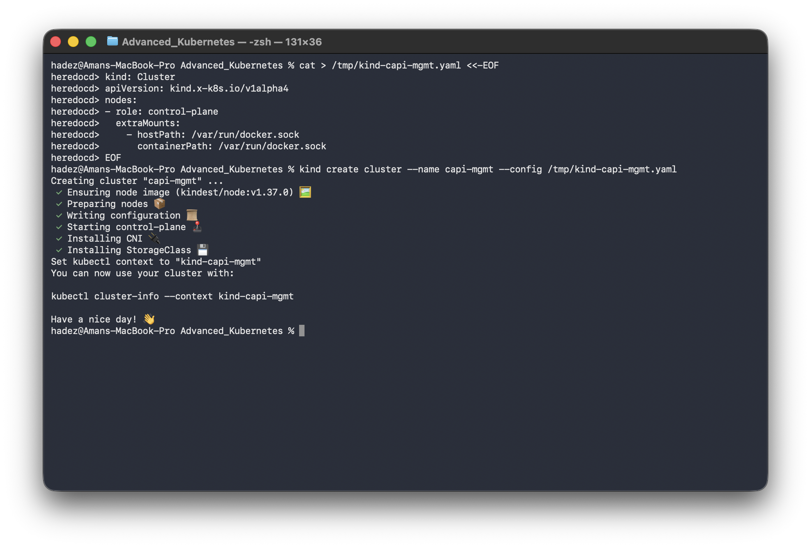

> **Tested gotcha:** if you skip `extraMounts` and just run `kind create cluster --name capi-mgmt`, cluster provisioning will fail later with `Cannot connect to the Docker daemon at unix:///var/run/docker.sock` — the CAPD controller pod simply has no socket to talk to. We hit exactly this on the first attempt; the fix above is required, not optional.

### A.3 Initialize Cluster API

```bash
export CLUSTER_TOPOLOGY=true
clusterctl init --infrastructure docker
```

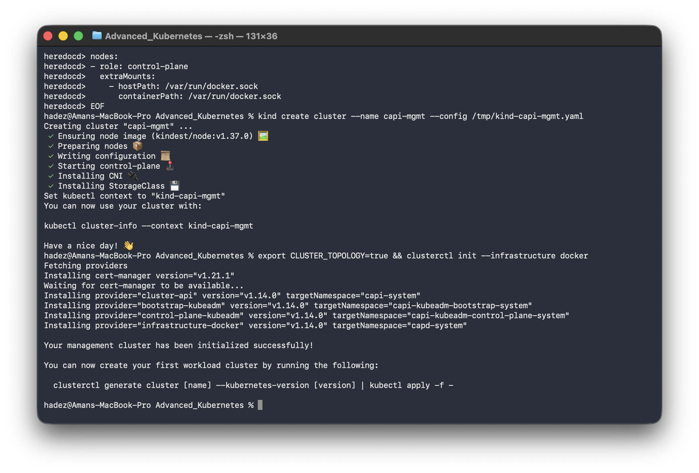

This installs cert-manager, the core CAPI controller, the kubeadm bootstrap and control-plane providers, and the Docker infrastructure provider (CAPD) — **seven deployments total**: four CAPI-related (`capi-controller-manager`, `capi-kubeadm-bootstrap-controller-manager`, `capi-kubeadm-control-plane-controller-manager`, `capd-controller-manager`) plus cert-manager's own three (`cert-manager`, `cert-manager-cainjector`, `cert-manager-webhook`). Wait for them, then count them:

```bash
kubectl wait --for=condition=Available --timeout=120s \
  -n capd-system deployment/capd-controller-manager
kubectl wait --for=condition=Available --timeout=120s \
  -n capi-kubeadm-bootstrap-system deployment/capi-kubeadm-bootstrap-controller-manager
kubectl wait --for=condition=Available --timeout=120s \
  -n capi-kubeadm-control-plane-system deployment/capi-kubeadm-control-plane-controller-manager
kubectl get pods -A | grep -E 'capi|capd|cert-manager'
```

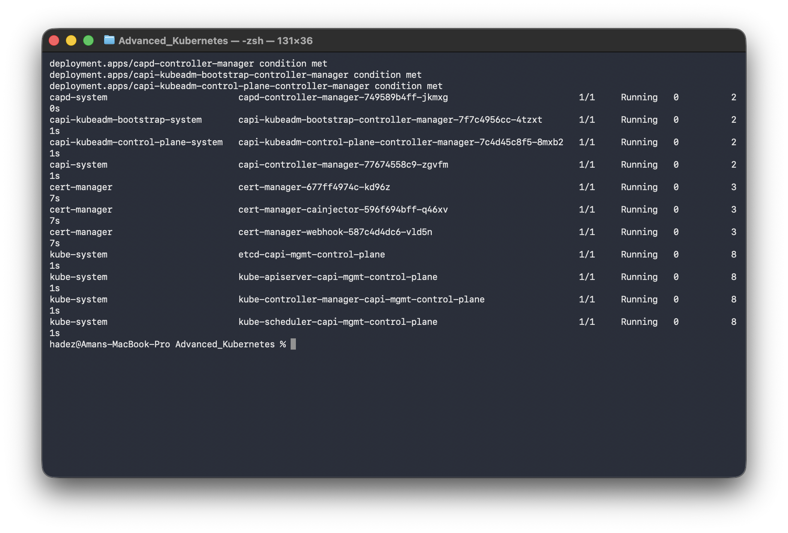

### A.4 Generate and apply a workload cluster

The first, easy-to-hit mistake — omitting `--flavor development`:

```bash
clusterctl generate cluster capi-workload --infrastructure docker --kubernetes-version v1.33.1 --control-plane-machine-count=1 --worker-machine-count=2
```

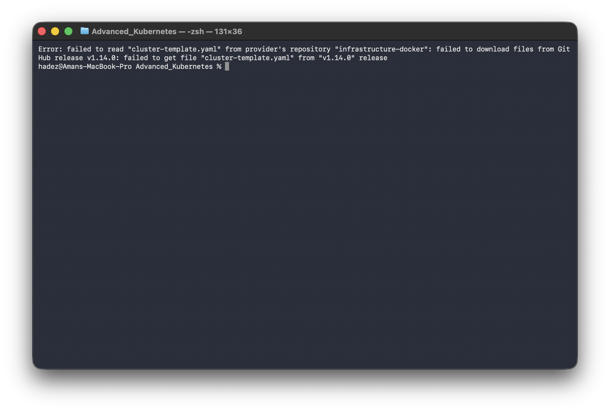

> **Tested gotcha:** `clusterctl generate cluster ... --infrastructure docker` **without** `--flavor development` fails with `failed to read "cluster-template.yaml" from provider's repository`. The Docker provider doesn't publish a default template — CAPI's own quick-start release only ships `cluster-template-development.yaml` for it. Always pass `--flavor development` with the Docker provider.

The corrected command:

```bash
clusterctl generate cluster capi-workload \
  --infrastructure docker \
  --flavor development \
  --kubernetes-version v1.33.1 \
  --control-plane-machine-count=1 \
  --worker-machine-count=2 \
  | kubectl apply -f -
```

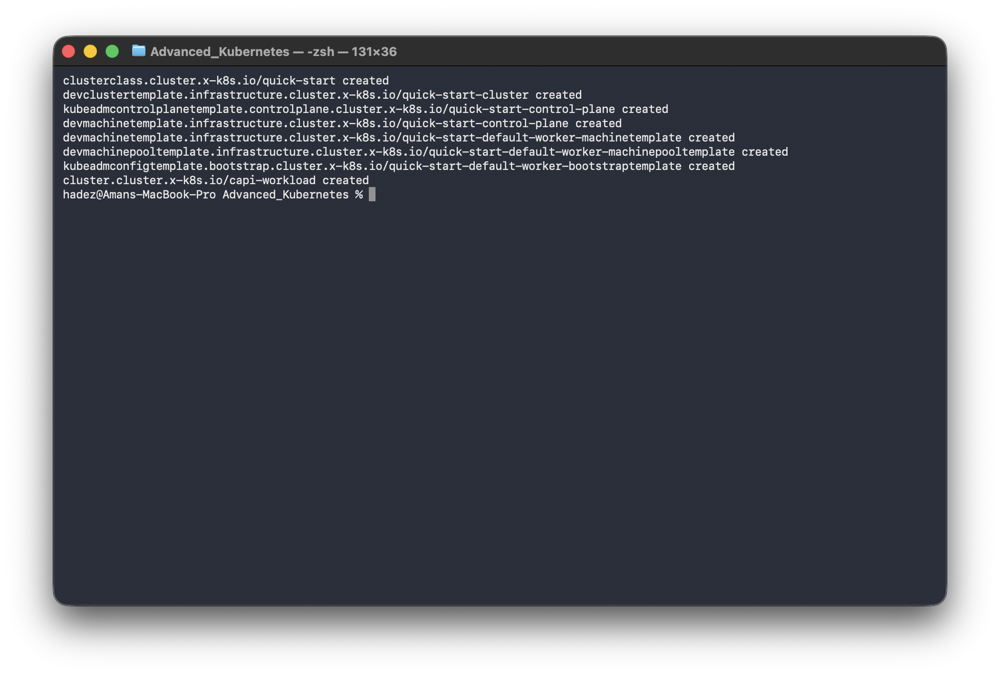

Watch it come up:

```bash
watch clusterctl describe cluster capi-workload
```

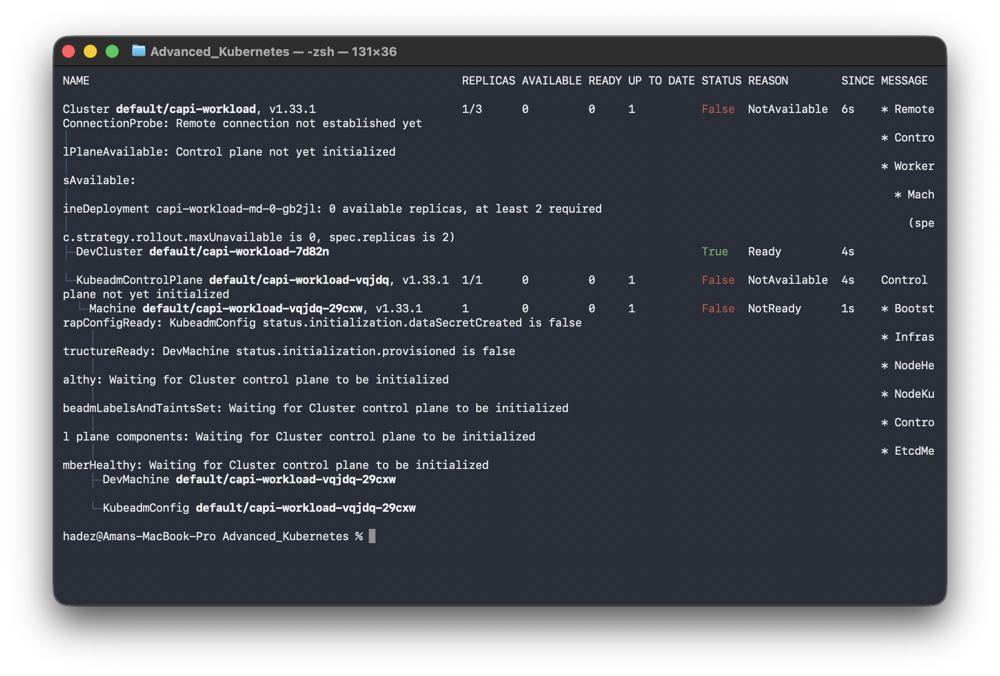

You'll see a `Cluster`, a `DevCluster`, a `KubeadmControlPlane` with one `Machine`, and a `MachineDeployment` with two `Machine`s, each transitioning through provisioning states. Wait for the control plane specifically before moving on:

```bash
kubectl wait --for=condition=ControlPlaneInitialized cluster/capi-workload --timeout=300s
clusterctl describe cluster capi-workload
```

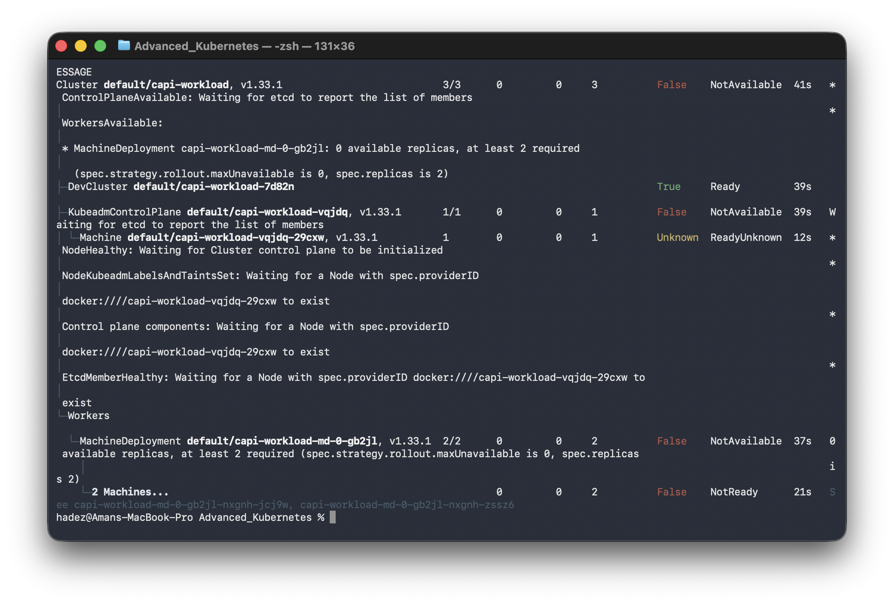

### A.5 Get the workload cluster's kubeconfig

```bash
clusterctl get kubeconfig capi-workload > capi-workload.kubeconfig
KUBECONFIG=capi-workload.kubeconfig kubectl get nodes
```

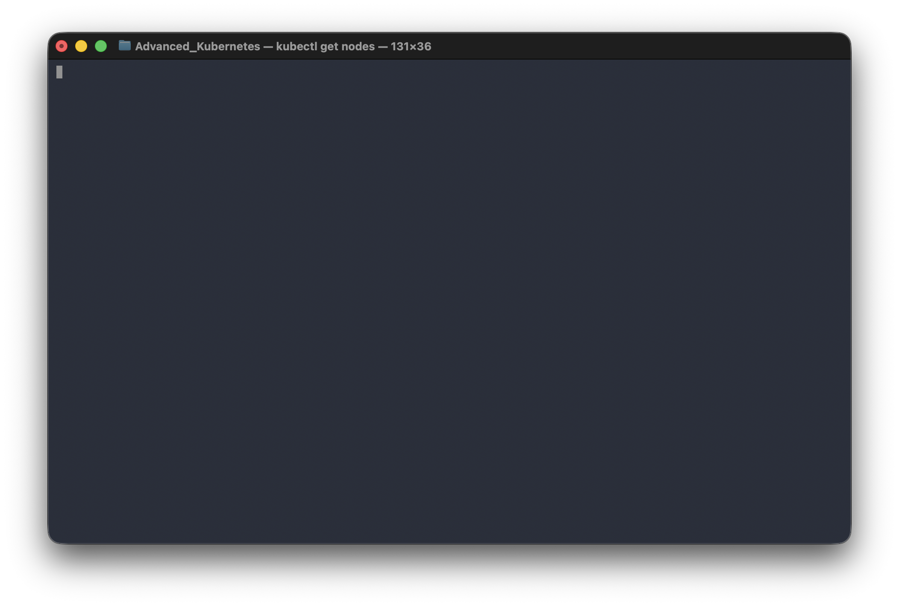

> **Tested gotcha (macOS / Windows Docker Desktop only):** the kubeconfig `clusterctl` generates points `server:` at an internal Docker network IP (e.g. `https://172.19.0.3:6443`). On Linux this is directly reachable from the host; **on Docker Desktop for Mac/Windows it is not**, because containers run inside a hidden VM. You'll see `kubectl get nodes` hang and time out with `dial tcp 172.19.0.3:6443: i/o timeout`.
>
> Fix: find the load balancer container's published port and patch the kubeconfig to use it instead:
>
> ```bash
> docker port capi-workload-lb
> # 6443/tcp -> 0.0.0.0:55000   <- your port number will differ
>
> sed -i.bak 's|https://172.19.0.3:6443|https://127.0.0.1:55000|' capi-workload.kubeconfig
> ```
>
> Substitute the IP `clusterctl` actually gave you and the port `docker port` actually reports — both vary per run.

After the patch:

```bash
KUBECONFIG=capi-workload.kubeconfig kubectl get nodes
```

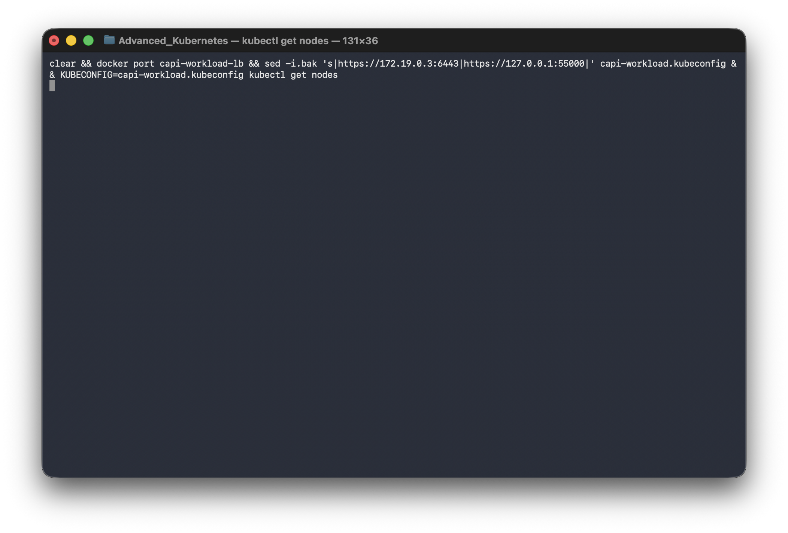

Nodes appear but are `NotReady`. This is expected and is not a bug — like any freshly-kubeadm'd cluster, there's no CNI yet.

### A.6 Install a CNI

The `development` flavor deliberately leaves CNI installation to you:

```bash
KUBECONFIG=capi-workload.kubeconfig kubectl apply \
  -f https://raw.githubusercontent.com/projectcalico/calico/v3.29.1/manifests/calico.yaml
```

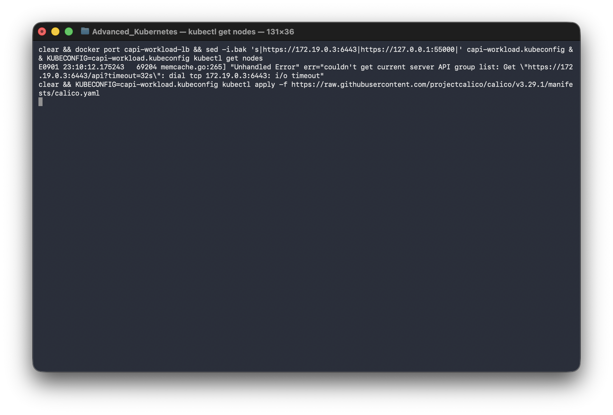

```bash
KUBECONFIG=capi-workload.kubeconfig kubectl wait --for=condition=Ready nodes --all --timeout=180s
KUBECONFIG=capi-workload.kubeconfig kubectl get nodes -o wide
```

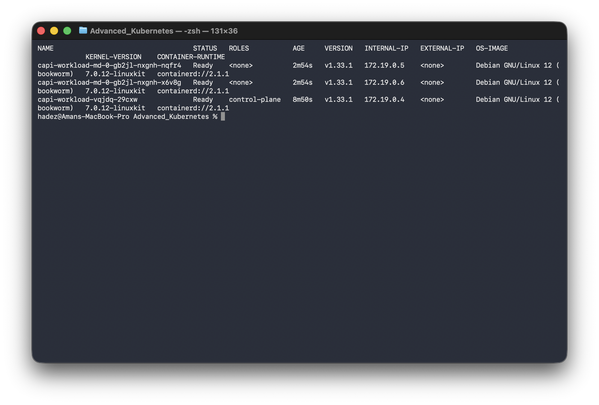

```bash
clusterctl describe cluster capi-workload
```

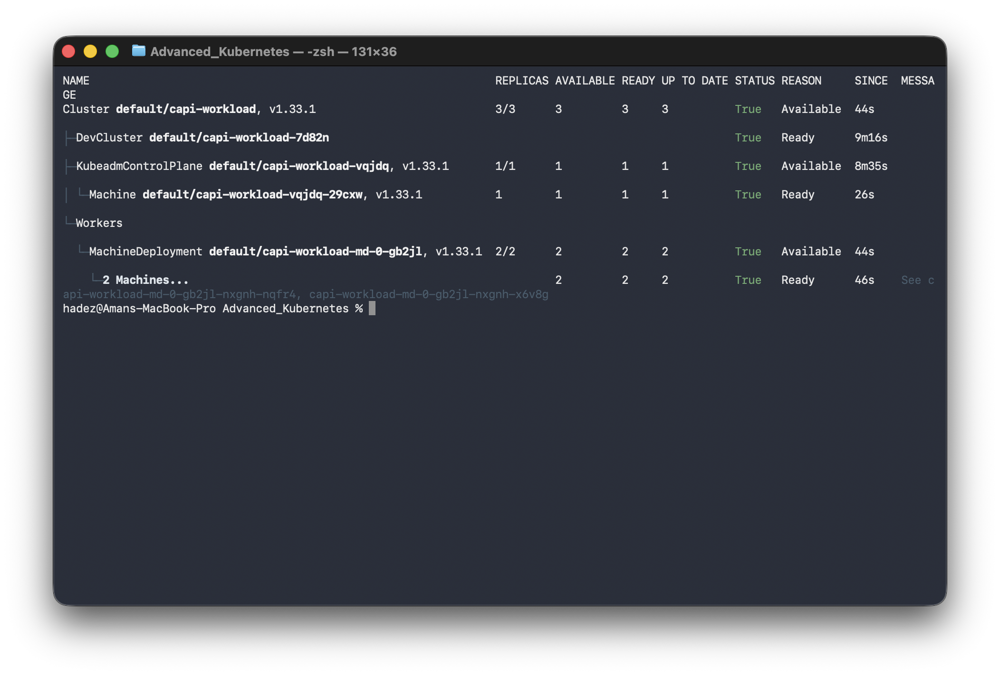

Full captured output: [`evidence/lab01-capi-workload-cluster.txt`](evidence/lab01-capi-workload-cluster.txt).

**This is the result the lab is aiming at: a real 3-node Kubernetes cluster, provisioned declaratively by applying YAML to another cluster** — exactly the workflow CAPI uses against AWS, Azure, and GCP in production. Only the infrastructure provider changes.

```bash
KUBECONFIG=capi-workload.kubeconfig kubectl get pods -A
```

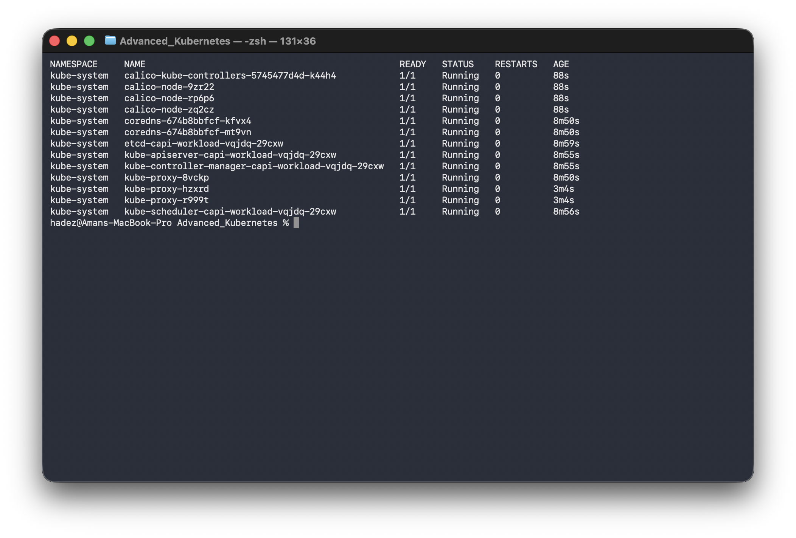

### A.7 Explore: scaling the workers

The instinctive way to scale is to patch the `MachineDeployment` directly:

```bash
kubectl scale machinedeployment capi-workload-md-0-g5ntv --replicas=3
kubectl get machinedeployment capi-workload-md-0-g5ntv -w
```

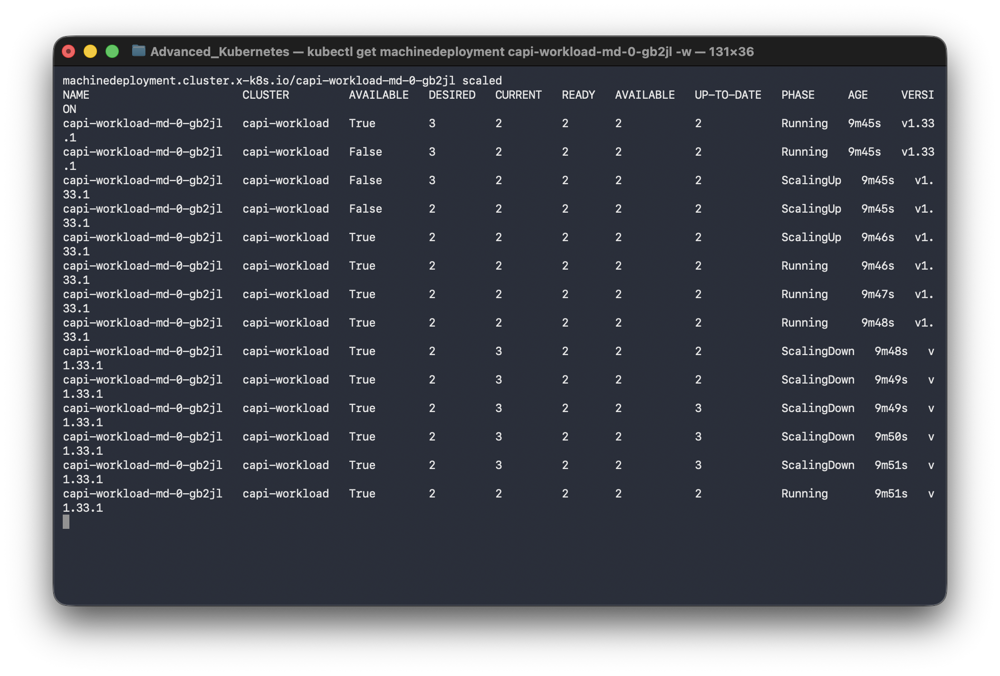

**Tested gotcha: this doesn't work.** Watch the `DESIRED` column — it accepts `3`, then reverts to `2` within a few seconds, before a third machine is ever created. The `development` flavor produces a **ClusterClass-managed** cluster, and the `MachineDeployment` is *owned by the `Cluster`* through `spec.topology`:

```bash
kubectl get machinedeployment capi-workload-md-0-g5ntv -o jsonpath='{.metadata.ownerReferences}'
kubectl get cluster capi-workload -o jsonpath='{.spec.topology.workers.machineDeployments}'
```

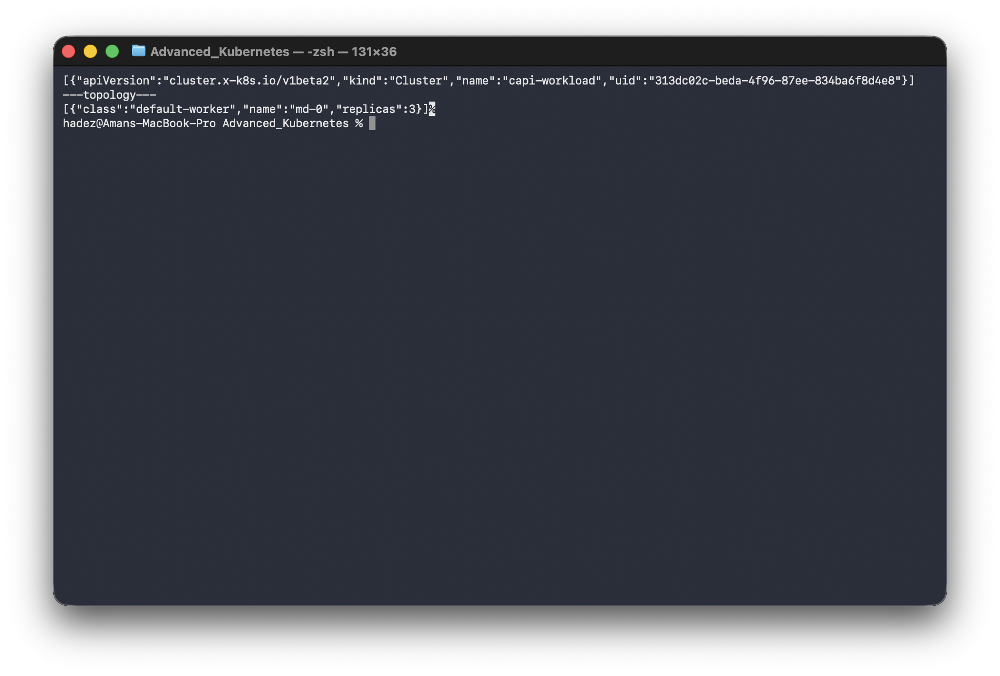

The `ownerReferences` show the `MachineDeployment` belongs to the `Cluster`, and `spec.topology.workers.machineDeployments[0].replicas` is still `2` — that field is the actual source of truth for a ClusterClass-managed cluster, so a direct scale gets reconciled away.

**Scale the topology instead:**

```bash
kubectl patch cluster capi-workload --type=merge \
  -p '{"spec":{"topology":{"workers":{"machineDeployments":[{"class":"default-worker","name":"md-0","replicas":3}]}}}}'

KUBECONFIG=capi-workload.kubeconfig kubectl get nodes -w
```

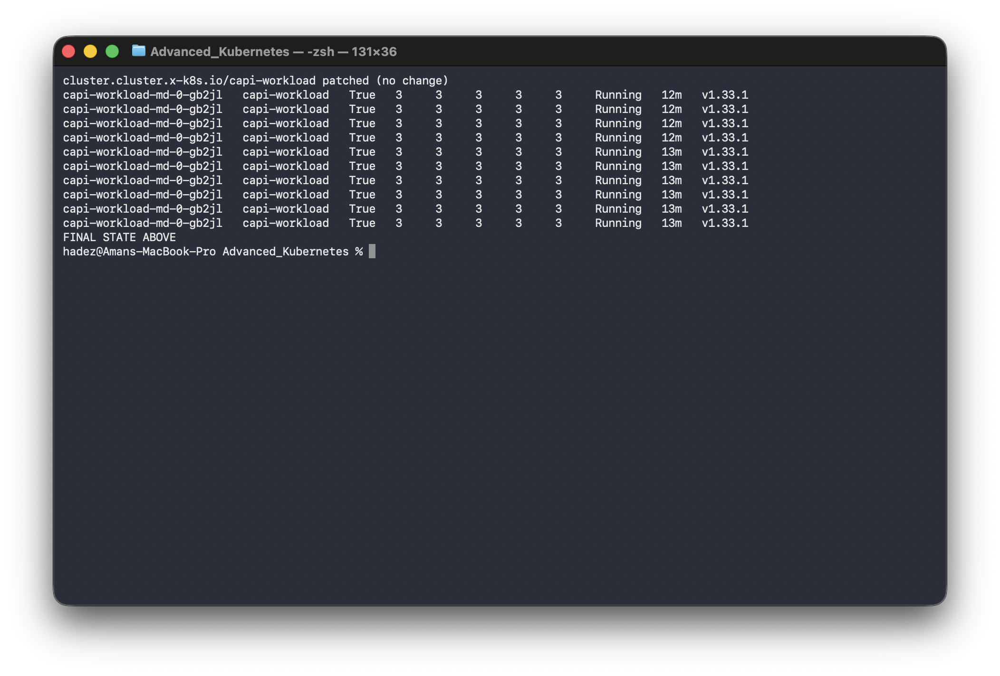

That sticks — `DESIRED`/`CURRENT`/`READY` settle at 3 and a fourth node joins. This is the practical difference between a plain CAPI cluster and a ClusterClass-managed one, and it's the kind of thing that quietly costs an afternoon in production if you don't know to look for it.

Scale back down to 2 with the same patch (`replicas: 2`) before continuing, to keep resource usage low.

### A.8 Clean up Part A

```bash
kubectl delete cluster capi-workload
```

Give this a minute — CAPI deletes `Machine`s, which triggers CAPD to remove the underlying containers. **Verify it actually happened**, because this is the single easiest thing to get wrong in this lab:

```bash
docker ps -a --filter "name=capi-workload"
```

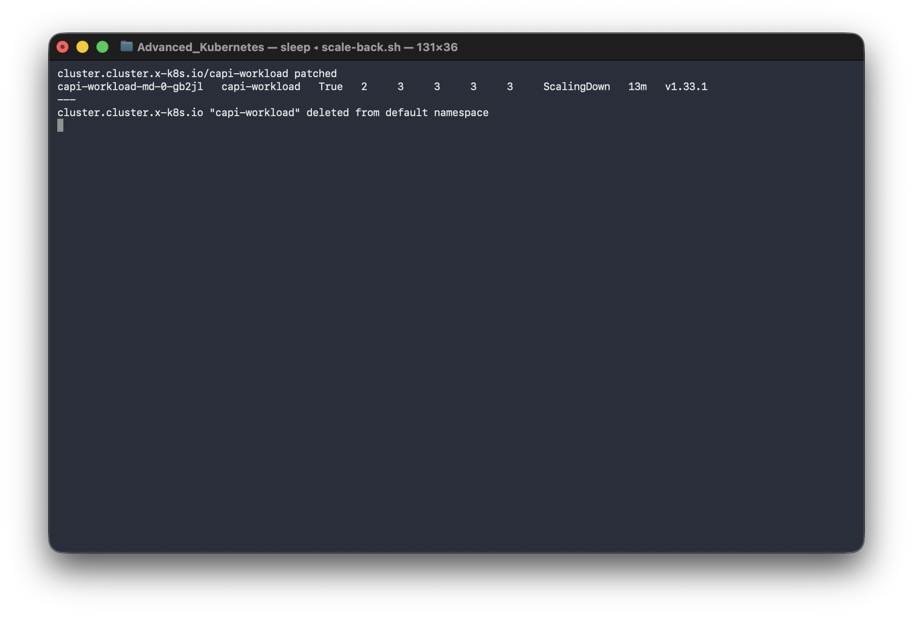
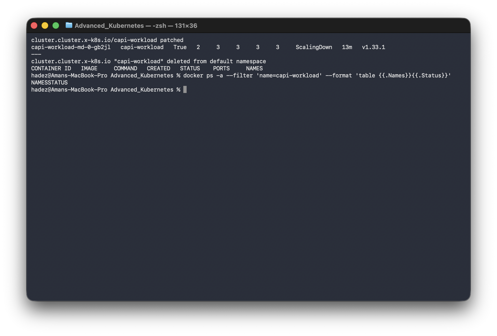

> **Tested gotcha:** deleting the **management** cluster (`kind delete cluster --name capi-mgmt`) does **not** clean up the workload cluster's containers — CAPD's controller, which is what actually calls `docker rm`, is gone the instant the management cluster is. We hit this directly: after `kind delete cluster --name capi-mgmt`, four `capi-workload-*` containers were still running and had to be removed by hand with `docker rm -f`. **Always delete the `Cluster` object first, confirm the containers are gone, and only then delete the management cluster.**

```bash
kind delete cluster --name capi-mgmt
```

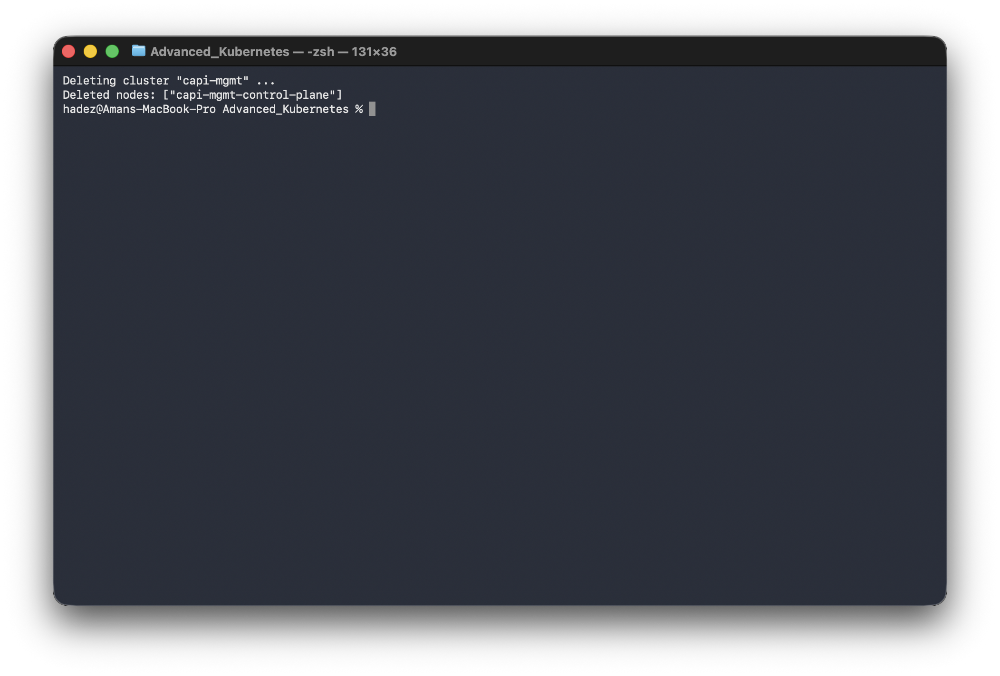

---

## Part B — KubeFed: concepts and a documented reality check

### B.1 What KubeFed was for

KubeFed (Kubernetes Cluster Federation v2) proposed a different multi-cluster model than CAPI: instead of provisioning clusters, it **federates already-running clusters** so that one API call fans out a resource to many clusters at once. The core objects:

- **Host cluster** — runs the KubeFed control plane.
- **Member clusters** — joined to the federation via `kubefedctl join`, registered as `KubeFedCluster` objects.
- **FederatedTypeConfig** — declares which resource types (Deployments, Services, ConfigMaps, ...) are federation-aware.
- **`Federated<Kind>`** — a wrapper resource (e.g. `FederatedDeployment`) with a `placement` (which clusters) and `overrides` (per-cluster differences, like a different replica count in each region).

This is a genuinely useful idea — it's the direct ancestor of what tools like Karmada and Open Cluster Management (OCM) do today.

### B.2 Why we walk you through this as a documented failure, not a live must-succeed exercise

**KubeFed was archived by SIG Multicluster on 2023-04-25** (moved to `kubernetes-retired/kubefed` on GitHub) and has had no commits since. We ran a full live install against this lab's own clusters as part of testing this material — three separate clean-slate attempts, reproduced below step by step with real terminal captures — and it failed every time, with three different errors in sequence. To rule out "too new a Kubernetes version for old software," we also repeated the test against `kindest/node:v1.21.14` — the Kubernetes minor version KubeFed actually targeted when it was archived. **It failed identically**, with the same certificate error, which rules out a version-compatibility issue and points instead to a real defect in the last published chart's webhook-certificate bootstrapping (most likely: the cert-rotation hook doesn't force the webhook pod to restart, so the `ValidatingWebhookConfiguration`'s CA bundle and the cert the pod actually serves fall out of sync).

Full failure logs and the isolation test: [`evidence/lab01-kubefed-compatibility-findings.txt`](evidence/lab01-kubefed-compatibility-findings.txt).

**The takeaway we want you to leave with:** this is not a lab environment problem, and it's not something you did wrong if you hit it yourself — it's the actual current state of an archived, unmaintained project. Treat any advice (including AI-generated advice, and including this document if it ages past its testing date) to "just deploy KubeFed" for a new multi-cluster project with real skepticism, and prefer its actively-maintained successors:

- **[Karmada](https://karmada.io/)** — CNCF project, closest conceptually to KubeFed, actively maintained.
- **[Open Cluster Management (OCM)](https://open-cluster-management.io/)** — CNCF project, broader multi-cluster lifecycle + policy + workload placement.
- Cluster API itself, paired with a GitOps tool (Argo CD `ApplicationSet`s, Flux) targeting multiple clusters — the pattern Lab 3 touches on.

### B.3 Reproducing it yourself, step by step

This is the same sequence we ran, on a fresh `kind` cluster — reproduce it yourself for the hands-on experience of diagnosing a broken third-party Helm chart, which is a genuinely useful skill in its own right.

```bash
kind create cluster --name kubefed-demo

helm repo add kubefed-charts https://raw.githubusercontent.com/kubernetes-retired/kubefed/master/charts
helm repo update
```

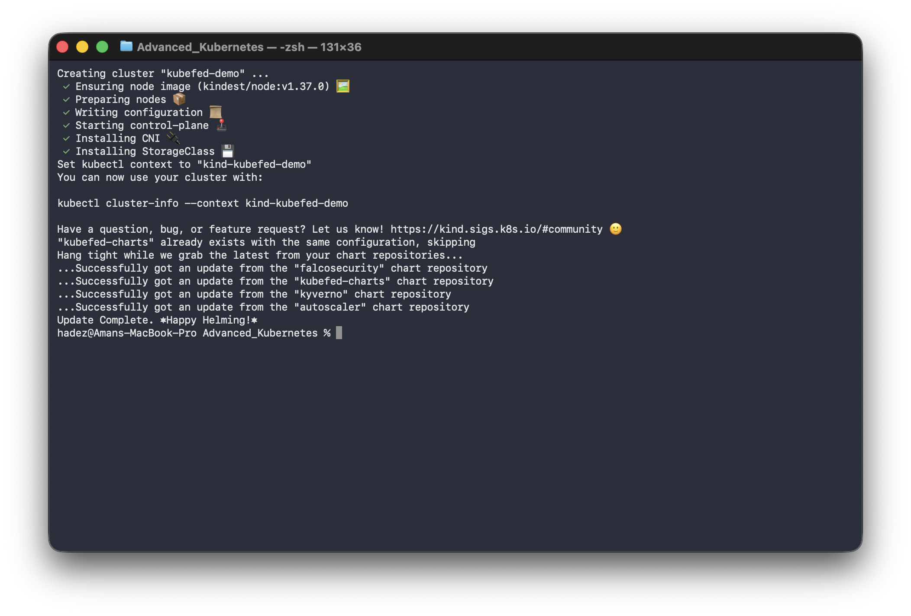

**Attempt 1 — the admission webhook refuses connections:**

```bash
helm upgrade --install kubefed kubefed-charts/kubefed \
  --namespace kube-federation-system --create-namespace --version=0.10.0
```

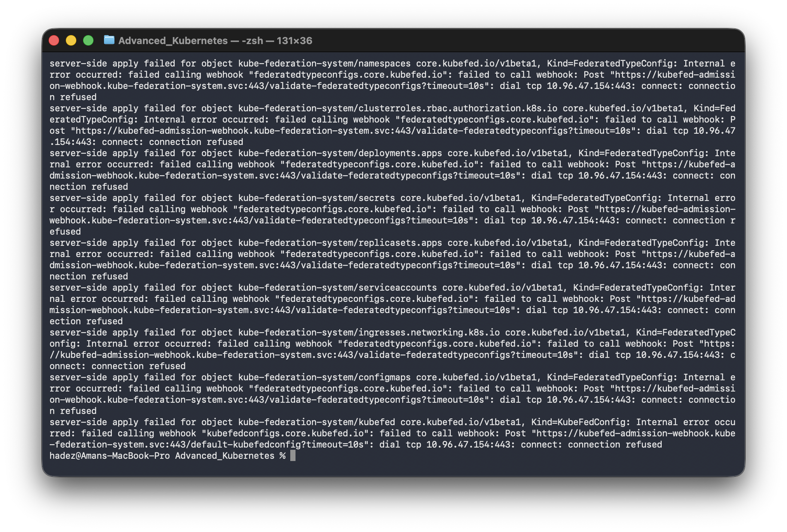

This part is a normal, if annoying, race — the webhook pod isn't ready yet when Helm applies the `FederatedTypeConfig` objects. Re-running the install is the documented workaround.

**Attempt 2 — retry once the webhook pod is `Ready`; the controller-manager crash-loops instead:**

```bash
kubectl get pods -n kube-federation-system -w
```

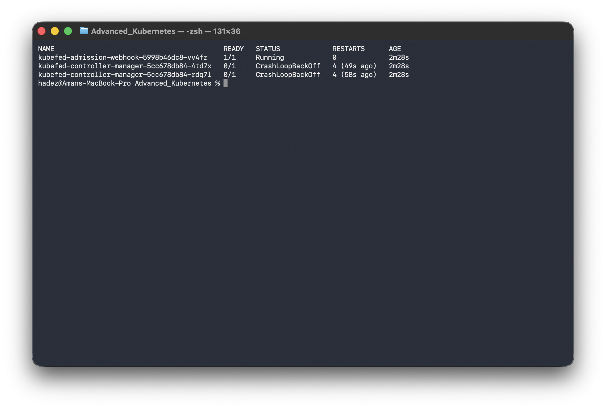

```bash
kubectl logs -n kube-federation-system -l kubefed-control-plane=controller-manager --tail=200 | grep -B1 -A3 -i "fatal\|F09"
```

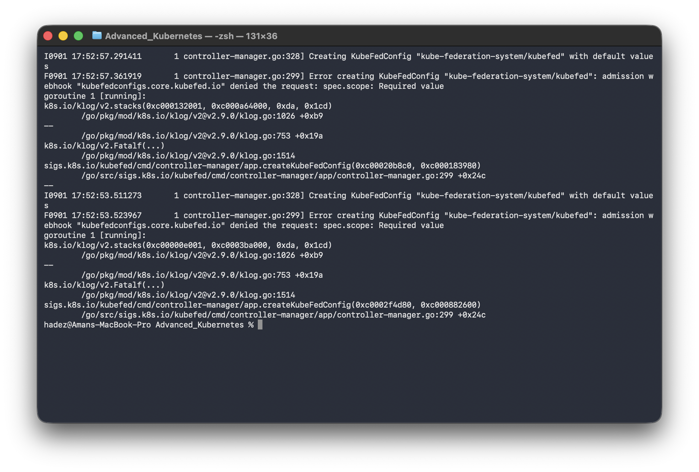

```
F0901 17:52:57.361919 1 controller-manager.go:299] Error creating KubeFedConfig
  "kube-federation-system/kubefed": admission webhook "kubefedconfigs.core.kubefed.io"
  denied the request: spec.scope: Required value
```

KubeFed's own controller writes a `KubeFedConfig` that KubeFed's own webhook rejects as invalid.

**Attempt 3 — full purge, then a clean two-pass reinstall:**

```bash
helm uninstall kubefed -n kube-federation-system
kubectl delete namespace kube-federation-system
kubectl get crd | grep kubefed.io | awk '{print $1}' | xargs kubectl delete crd
```

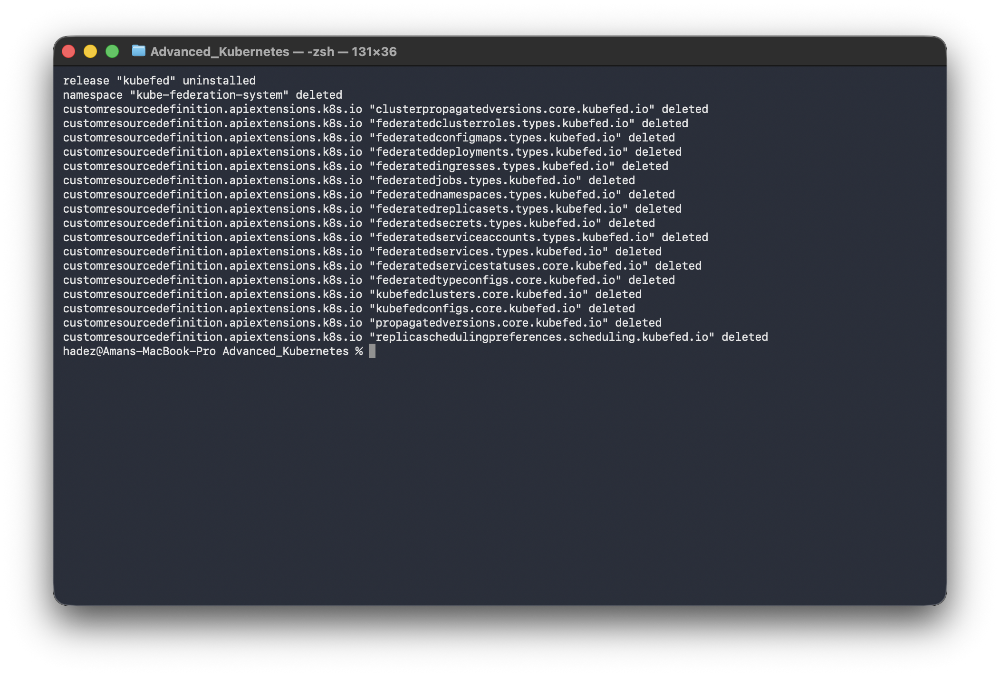

First pass after the purge fails the same way as attempt 1 (webhook not ready yet):

```bash
helm upgrade --install kubefed kubefed-charts/kubefed \
  --namespace kube-federation-system --create-namespace --version=0.10.0
```

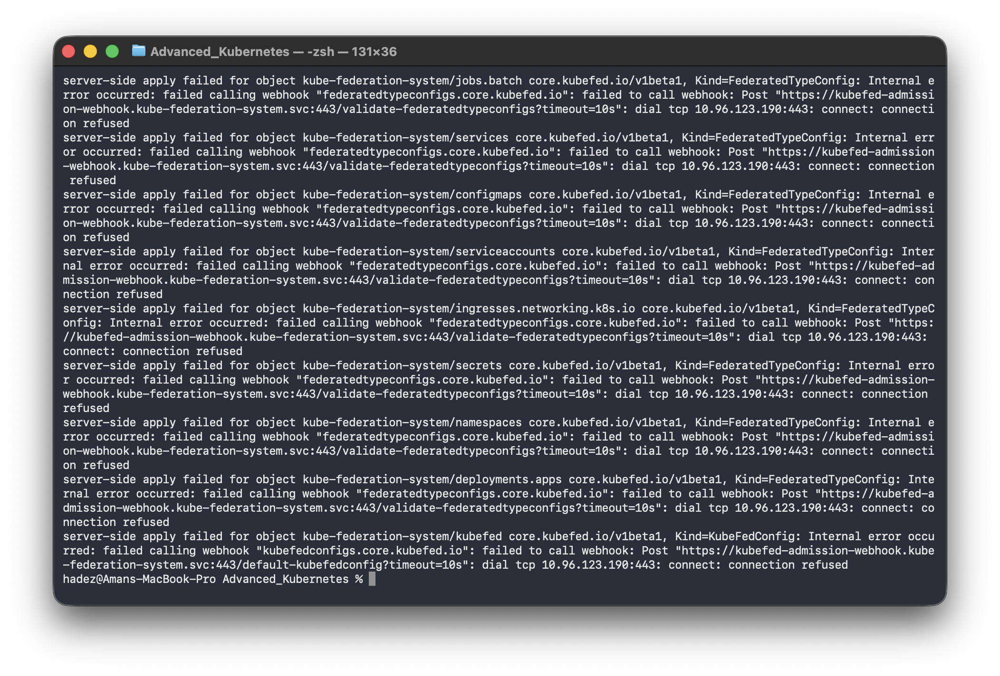

Second pass, webhook confirmed `Ready` first:

```bash
helm upgrade --install kubefed kubefed-charts/kubefed \
  --namespace kube-federation-system --create-namespace --version=0.10.0
```

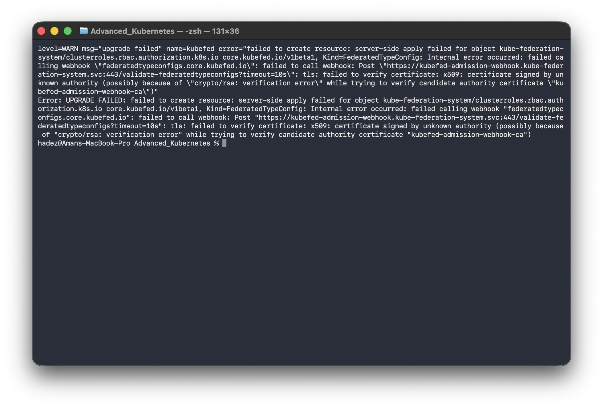

```
tls: failed to verify certificate: x509: certificate signed by unknown authority
(possibly because of "crypto/rsa: verification error" while trying to verify
candidate authority certificate "kubefed-admission-webhook-ca")
```

Third documented failure, reproduced verbatim — this is confirmed across multiple independent clean-slate runs of this lab, not a one-off fluke.

If you'd like to read the federation resource shapes without fighting the installer, here's what a working `FederatedDeployment` looks like conceptually — this is the object model whether or not the control plane behind it currently installs cleanly:

```yaml
apiVersion: types.kubefed.io/v1beta1
kind: FederatedDeployment
metadata:
  name: my-app
  namespace: demo
spec:
  template:            # a normal Deployment spec
    spec:
      replicas: 2
      template:
        spec:
          containers:
          - name: my-app
            image: my-app:v1
  placement:
    clusters:
    - name: cluster-east
    - name: cluster-west
  overrides:
  - clusterName: cluster-west
    clusterOverrides:
    - path: "/spec/replicas"
      value: 5           # cluster-west runs 5 replicas, cluster-east runs the default 2
```

Clean up when done:

```bash
kind delete cluster --name kubefed-demo
```

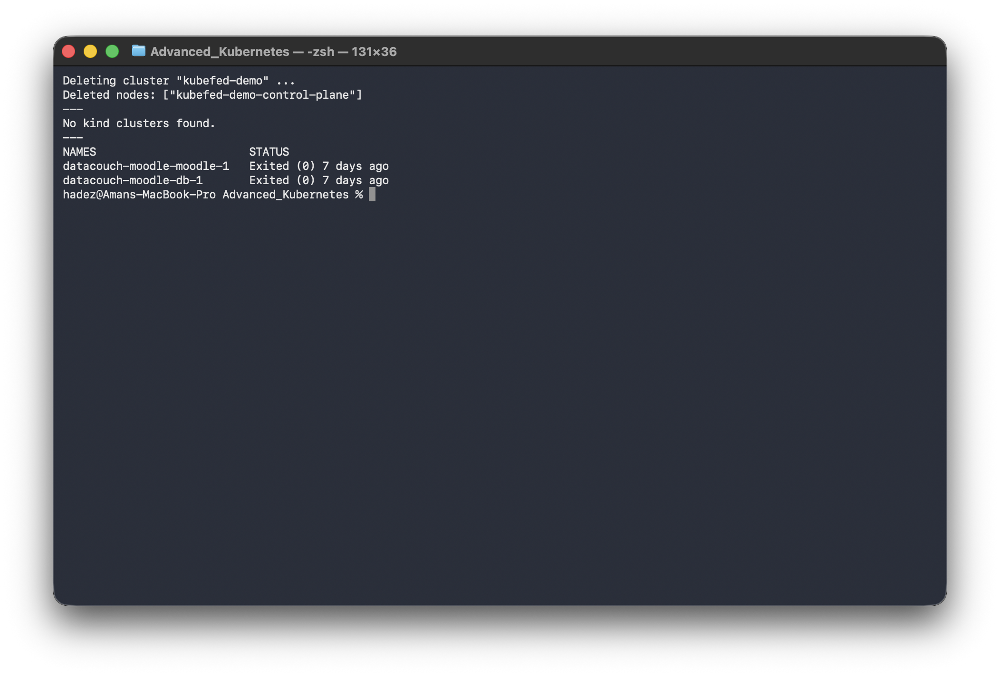

---

## Lab summary

| | Provisioned | Verified working | Notes |
|---|---|---|---|
| Cluster API (Docker provider) | ✅ | ✅ | 3-node cluster, full lifecycle tested including scale and teardown |
| KubeFed | Attempted | ❌ | Reproducibly broken; root-caused; modern alternatives given |

## Evidence

- Screenshots: [`screenshots/lab01/`](screenshots/lab01/) (27 images, real `screencapture` output)
- Logs: [`evidence/lab01-capi-workload-cluster.txt`](evidence/lab01-capi-workload-cluster.txt), [`evidence/lab01-kubefed-compatibility-findings.txt`](evidence/lab01-kubefed-compatibility-findings.txt)

**Next:** [Lab 2 — GKE fleet management with attached AWS and Azure clusters](lab-02-gke-fleet-attached-clusters.md)
