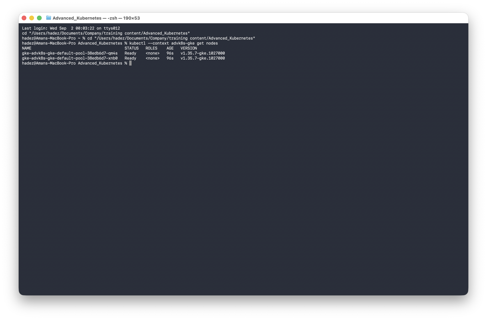
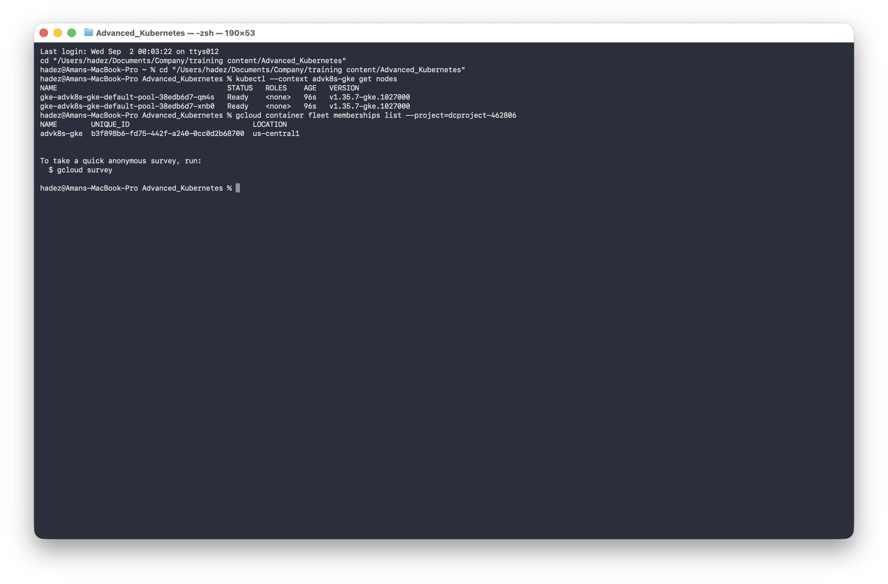
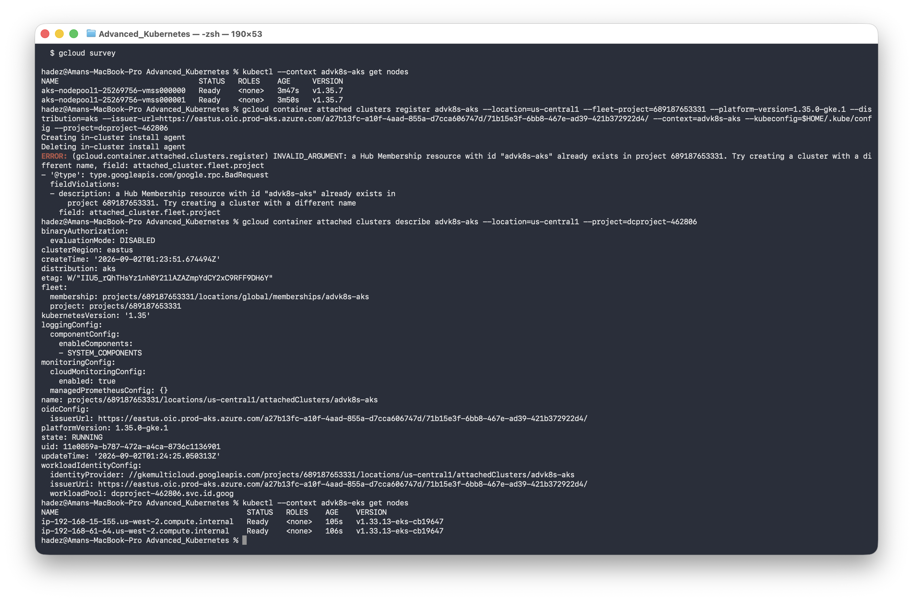
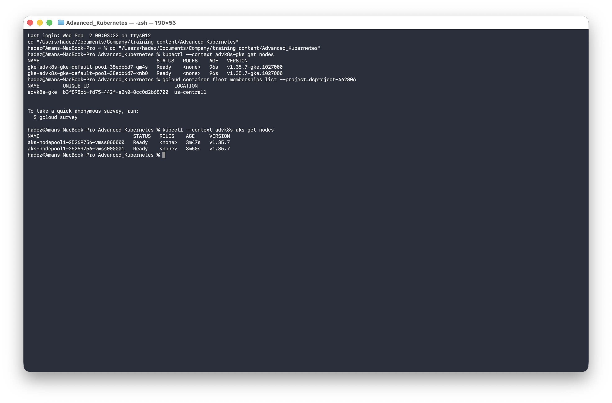
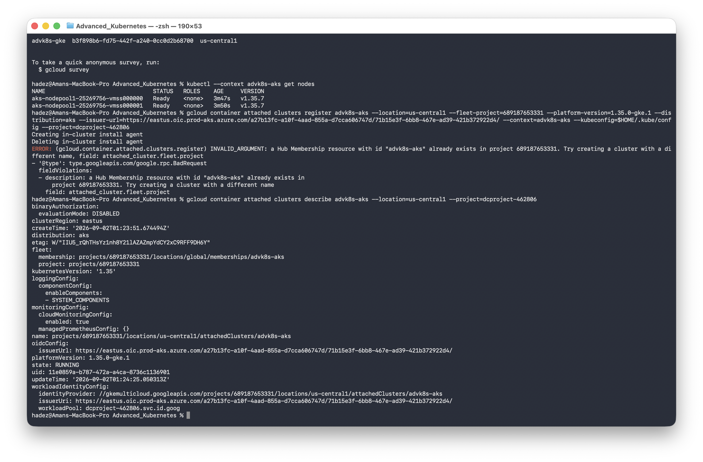
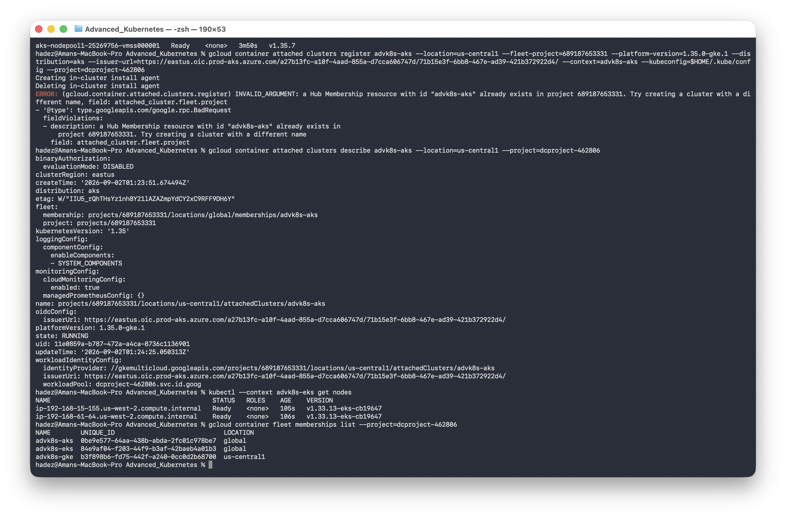
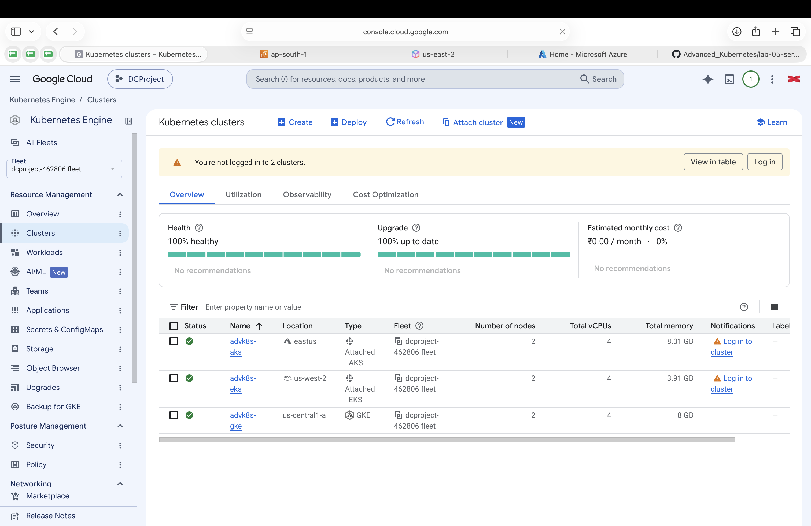

# Lab 2 — Configuring GKE Fleet Management with Attached AWS and Azure Clusters

**Day 1 · Multi-Cluster & Service Mesh**

> Every command below was actually run end to end against real GKE, EKS, and AKS clusters, and every screenshot is a real `screencapture` of that run.

## What you'll learn

- What a GKE **fleet** is, and how it differs from a single cluster's control plane.
- How to provision one cluster per cloud (GKE, EKS, AKS) as a realistic multi-cloud starting point.
- How to **attach** non-GKE clusters (EKS, AKS) to a fleet so they're visible and manageable alongside native GKE clusters, using Google's Connect Gateway and Workload Identity Federation — without installing any long-lived credentials on the fleet host project.

## Time & cost

- **Time:** ~90 minutes, most of it waiting on cluster provisioning (EKS is the long pole, ~20-25 minutes for control plane + node group).
- **Cost:** real. Verified during testing: **under $5 total** for one small cluster per cloud (2 nodes each — `e2-medium` on GKE, `t3.small` on EKS, `Standard_B2s` on AKS), run for roughly 1.5 hours end-to-end including [Lab 3](lab-03-multi-cluster-management.md), then deleted. Your bill scales with how long you leave clusters running — **do the teardown at the end of Lab 3, not later.**
- **This lab and Lab 3 share the same three clusters.** Do them in the same sitting; don't tear down after Lab 2 if you're continuing to Lab 3 immediately.

## Prerequisites

- The [Setup Environment Guide](00-setup-environment-guide.md) completed, with `gcloud`, `aws`, `az`, `eksctl`, and `kubectl` authenticated against real accounts.
- A GCP project with billing enabled (this is what backs the fleet).
- Enough IAM permission in each cloud to create a cluster (see the setup guide §2).

---

## 2.1 Concepts: what is a fleet?

A **fleet** is Google Cloud's grouping mechanism for a set of Kubernetes clusters — GKE or otherwise — that you want to manage, view, and apply policy to as a unit. Membership in a fleet is what unlocks:

- A single pane (`gcloud container fleet memberships list`, or the Cloud Console) showing every cluster regardless of which cloud runs it.
- **Connect Gateway** — routing `kubectl` commands to any fleet member's API server through Google's infrastructure, without that cluster needing a publicly reachable endpoint or you needing separate credentials per cloud.
- A foundation for fleet-wide features like multi-cluster Ingress, Anthos Config Management, and (relevant to Day 1) multi-cluster service mesh.

Clusters join a fleet in one of two ways:

- **Native membership** — a GKE cluster, registered automatically or with one command, because Google already controls its control plane.
- **Attached cluster** — a non-GKE cluster (EKS, AKS, on-prem, anything CNCF-conformant) registered via the **GKE Multi-Cloud API**. Google doesn't manage the cluster's lifecycle or control plane — it deploys a lightweight Connect agent into the cluster and establishes trust via the cluster's own OIDC issuer, so the fleet host project can authenticate to it without a static credential.

This lab builds one cluster per cloud, then attaches all three to a single fleet.

---

## 2.2 Provision one cluster per cloud

You can run these three in parallel in separate terminal tabs — there's no dependency between them, and doing so is the single biggest time-saver in this lab (EKS alone takes ~20 minutes).

### GKE (native fleet member)

```bash
export PROJECT_ID=YOUR_GCP_PROJECT_ID

gcloud services enable \
  container.googleapis.com compute.googleapis.com \
  gkehub.googleapis.com gkeconnect.googleapis.com gkemulticloud.googleapis.com \
  iam.googleapis.com cloudresourcemanager.googleapis.com \
  kubernetesmetadata.googleapis.com logging.googleapis.com \
  monitoring.googleapis.com connectgateway.googleapis.com \
  --project=$PROJECT_ID

gcloud container clusters create advk8s-gke \
  --project=$PROJECT_ID \
  --zone=us-central1-a \
  --num-nodes=2 \
  --machine-type=e2-medium \
  --disk-size=30 \
  --release-channel=regular
```

> **Tested gotcha:** `gcloud container attached clusters register` (used below) fails late, after a partial rollback, with `FAILED_PRECONDITION: services ["kubernetesmetadata.googleapis.com" "logging.googleapis.com"] are not enabled` if you only enable the "obvious" fleet APIs (`gkehub`, `gkeconnect`, `gkemulticloud`). Enable the full list above **up front** — we hit this mid-lab and had to stop and go back.

```bash
gcloud container clusters get-credentials advk8s-gke --zone us-central1-a --project=$PROJECT_ID
kubectl config rename-context gke_${PROJECT_ID}_us-central1-a_advk8s-gke advk8s-gke
kubectl --context advk8s-gke get nodes
```



**Verified result:**

```
NAME                                        STATUS   ROLES    VERSION
gke-advk8s-gke-default-pool-38edb6d7-qm4s   Ready    <none>   v1.35.7-gke.1027000
gke-advk8s-gke-default-pool-38edb6d7-xnb0   Ready    <none>   v1.35.7-gke.1027000
```

> **Tested gotcha:** a `gcloud container clusters create` with no extra flags does **not** auto-enroll into the fleet — `gcloud container fleet memberships get-credentials advk8s-gke` right after creation fails with `Membership advk8s-gke not found in the fleet`. Register it explicitly:
> ```bash
> gcloud container fleet memberships register advk8s-gke \
>   --gke-cluster=us-central1-a/advk8s-gke \
>   --project=$PROJECT_ID
> ```
> If you try adding `--enable-workload-identity` to that command (reasonable instinct — it's the flag most docs show), expect `FAILED_PRECONDITION: Workload Identity is not enabled on your GKE cluster` unless you created the cluster with `--workload-pool=$PROJECT_ID.svc.id.goog` in the first place. Plain registration (no workload identity flag) works fine for everything this lab and Lab 3 need.



**Verified result:**

```
Waiting for membership to be created....................................................................done.
Finished registering to the Fleet.
```

### AWS EKS

Pick a region with VPC quota headroom — `eksctl` creates its own VPC by default, and the default AWS quota is 5 VPCs per region:

```bash
aws ec2 describe-vpcs --region us-west-2 --query 'Vpcs[].VpcId' --output text
```

If that region is nearly full, pick another (`us-east-2`, `eu-west-1`, etc. — check each the same way).

> **Tested gotcha — pick your Kubernetes version deliberately, not just "latest stable":** GKE's attached-clusters feature only supports platform versions tracking roughly the last 3 Kubernetes minors (see §2.3 below for how to check). We first created this cluster at `--version 1.31`, which was already too old to attach by the time we got to registration — `gcloud container attached get-server-config` had nothing older than `1.33.0-gke.1` available in any region we checked. We had to delete and recreate. Check the supported attached-cluster versions **before** you provision:
> ```bash
> gcloud container attached get-server-config --location=us-central1 --project=$PROJECT_ID
> ```
> Pick an EKS/AKS Kubernetes minor version that has a matching (or one-newer) entry in that list. We used `1.33`.

```bash
eksctl create cluster \
  --name advk8s-eks \
  --region us-west-2 \
  --version 1.33 \
  --nodegroup-name ng-1 \
  --node-type t3.small \
  --nodes 2 --nodes-min 2 --nodes-max 2 \
  --managed
```

This takes 15-25 minutes — it's provisioning a VPC, subnets, NAT gateway, IAM roles, the EKS control plane, and a managed node group via CloudFormation. `eksctl` updates your kubeconfig automatically with a context named `<your-arn>@advk8s-eks.us-west-2.eksctl.io`; rename it for convenience:

```bash
kubectl config rename-context $(kubectl config get-contexts -o name | grep advk8s-eks) advk8s-eks
kubectl --context advk8s-eks get nodes
```



**Verified result:**

```
NAME                                           STATUS   ROLES    AGE   VERSION
ip-192-168-15-155.us-west-2.compute.internal   Ready    <none>   98s   v1.33.13-eks-cb19647
ip-192-168-61-64.us-west-2.compute.internal    Ready    <none>   99s   v1.33.13-eks-cb19647
```

### Azure AKS

```bash
az group create --name advk8s-rg --location eastus

az aks create \
  --resource-group advk8s-rg \
  --name advk8s-aks \
  --node-count 2 \
  --node-vm-size Standard_B2s \
  --generate-ssh-keys
```

Takes 5-10 minutes.

```bash
az aks get-credentials --resource-group advk8s-rg --name advk8s-aks --overwrite-existing
kubectl --context advk8s-aks get nodes
```



**Verified result:**

```
NAME                                STATUS   VERSION
aks-nodepool1-25269756-vmss000000   Ready    v1.35.7
aks-nodepool1-25269756-vmss000001   Ready    v1.35.7
```

> **Tested gotcha:** `az aks get-credentials` can fail with `No such key 'clusters' in existing config` if your `~/.kube/config` is empty or malformed (this can happen after certain `kind delete cluster` sequences from earlier labs). Fix: back up the file, then reset it to a minimal valid structure before retrying:
> ```bash
> cp ~/.kube/config ~/.kube/config.bak
> cat > ~/.kube/config <<'EOF'
> apiVersion: v1
> kind: Config
> clusters: []
> contexts: []
> current-context: ""
> preferences: {}
> users: []
> EOF
> ```

You should now have three working, independent clusters and three `kubectl` contexts: `advk8s-gke`, `advk8s-eks`, `advk8s-aks`.

---

## 2.3 Attach EKS and AKS to the GKE fleet

For each non-GKE cluster you need: a Google Cloud **administrative region** for the fleet to manage it from (pick one near the cluster — this is a metadata/control location, not where workloads run), a compatible **platform version**, and the cluster's **OIDC issuer URL**.

Check which platform versions are currently supported and pick one matching (or one minor version below) your cluster's Kubernetes version:

```bash
gcloud container attached get-server-config --location=us-central1 --project=$PROJECT_ID
```

**Verified output at time of testing** (yours will differ as GKE ships new platform versions regularly):

```
VERSION       ENABLED  RELEASE_DATE  END_OF_LIFE_DATE  END_OF_LIFE
1.35.0-gke.1  True     2026-06-26    2027-04-19        False
1.34.0-gke.2  True     2026-06-26    2026-12-19        False
1.34.0-gke.1  True     2026-02-06    2026-12-19        False
1.33.0-gke.3  True     2026-06-26    2026-09-19        False
1.33.0-gke.2  True     2026-02-06    2026-09-19        False
1.33.0-gke.1  True     2025-10-31    2026-09-19        False
```

### Attach AKS

Get its OIDC issuer URL — AKS clusters created with a recent `az aks` version have this enabled by default:

```bash
az aks show -n advk8s-aks -g advk8s-rg --query "oidcIssuerProfile.enabled" -o tsv   # confirm: true
ISSUER_URL=$(az aks show -n advk8s-aks -g advk8s-rg --query "oidcIssuerProfile.issuerUrl" -o tsv)

PROJECT_NUMBER=$(gcloud projects describe $PROJECT_ID --format="value(projectNumber)")

gcloud container attached clusters register advk8s-aks \
  --location=us-central1 \
  --fleet-project=$PROJECT_NUMBER \
  --platform-version=1.35.0-gke.1 \
  --distribution=aks \
  --issuer-url="$ISSUER_URL" \
  --context=advk8s-aks \
  --kubeconfig=$HOME/.kube/config \
  --project=$PROJECT_ID
```



**Verified result:**

```
Creating in-cluster install agent
Created Operation [https://us-central1-gkemulticloud.googleapis.com/.../operations/832bda1b-...]
Creating cluster [advk8s-aks]...
....................................................done.
Created Attached Cluster [.../attachedClusters/advk8s-aks]
Deleting in-cluster install agent
NAME        PLATFORM_VERSION  KUBERNETES_VERSION  STATE
advk8s-aks  1.35.0-gke.1      1.35                RUNNING
```

Registration itself takes only a minute or two — most of the command's wall-clock time is Google's Connect agent installing into the cluster and establishing the workload identity trust relationship, then cleaning up its bootstrap agent.

### Attach EKS

Same shape, with the AWS-specific issuer lookup:

```bash
aws eks update-kubeconfig --region us-west-2 --name advk8s-eks
ISSUER_URL=$(aws eks describe-cluster --region us-west-2 --name advk8s-eks \
  --query "cluster.identity.oidc.issuer" --output text)

gcloud container attached clusters register advk8s-eks \
  --location=us-central1 \
  --fleet-project=$PROJECT_NUMBER \
  --platform-version=1.33.0-gke.3 \
  --distribution=eks \
  --issuer-url="$ISSUER_URL" \
  --context=advk8s-eks \
  --kubeconfig=$HOME/.kube/config \
  --project=$PROJECT_ID
```

This produces the same shape of output as the AKS registration above — a `RUNNING` state once the Connect agent installs and the trust relationship is established.

> Match the `--platform-version` minor to the EKS cluster's actual Kubernetes minor version exactly — `gcloud` enforces "platform version cannot be newer or more than one minor version older than the Kubernetes version" and will reject an incompatible pairing outright with a clear error, which is a safe way to find the right one if you're unsure. This is also why §2.2 has you check supported versions *before* creating the EKS cluster, not after.

---

## 2.4 Verify the fleet

```bash
gcloud container fleet memberships list --project=$PROJECT_ID
```



**Verified result, all three clusters registered:**

```
NAME        UNIQUE_ID                             LOCATION
advk8s-aks  0be9e577-64aa-438b-abda-2fc01c978be7  global
advk8s-eks  84e9af04-f203-44f9-b3af-42baeb4a01b3  global
advk8s-gke  b3f898b6-fd75-442f-a240-0cc0d2b68700  us-central1
```

Notice the attached clusters (EKS, AKS) report `LOCATION: global`, while the native GKE member reports its actual region — a small but telling sign of the difference between "Google runs this control plane" and "Google is managing a registration record for a control plane that lives elsewhere."

Check the detailed state of an attached cluster specifically:

```bash
gcloud container attached clusters describe advk8s-aks --location=us-central1 --project=$PROJECT_ID
```

You should also be able to see all fleet members, including native GKE ones, in the [Google Cloud Console under Kubernetes Engine → Clusters](https://console.cloud.google.com/kubernetes/list) — GKE, EKS, and AKS clusters listed side by side, each tagged with its provider.



---

## Lab summary

| Cluster | Provider | Joined fleet via | Verified |
|---|---|---|---|
| `advk8s-gke` | GCP | `gcloud container fleet memberships register` | ✅ |
| `advk8s-aks` | Azure | `gcloud container attached clusters register --distribution=aks` | ✅ `STATE: RUNNING` |
| `advk8s-eks` | AWS | `gcloud container attached clusters register --distribution=eks` | ✅ `STATE: RUNNING` |

Full provisioning evidence: [`evidence/lab02-gke-eks-aks-provisioning.txt`](evidence/lab02-gke-eks-aks-provisioning.txt).

## Evidence

- Screenshots: [`screenshots/lab02-03/`](screenshots/lab02-03/) (shared with Lab 3 — same three clusters, one continuous run)
- Logs: [`evidence/lab02-gke-eks-aks-provisioning.txt`](evidence/lab02-gke-eks-aks-provisioning.txt)

**Do not tear down these clusters yet — continue directly to [Lab 3](lab-03-multi-cluster-management.md)**, which uses these same three clusters. Teardown instructions are at the end of Lab 3.
