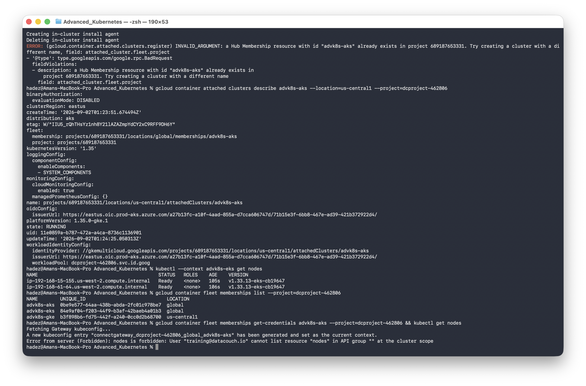
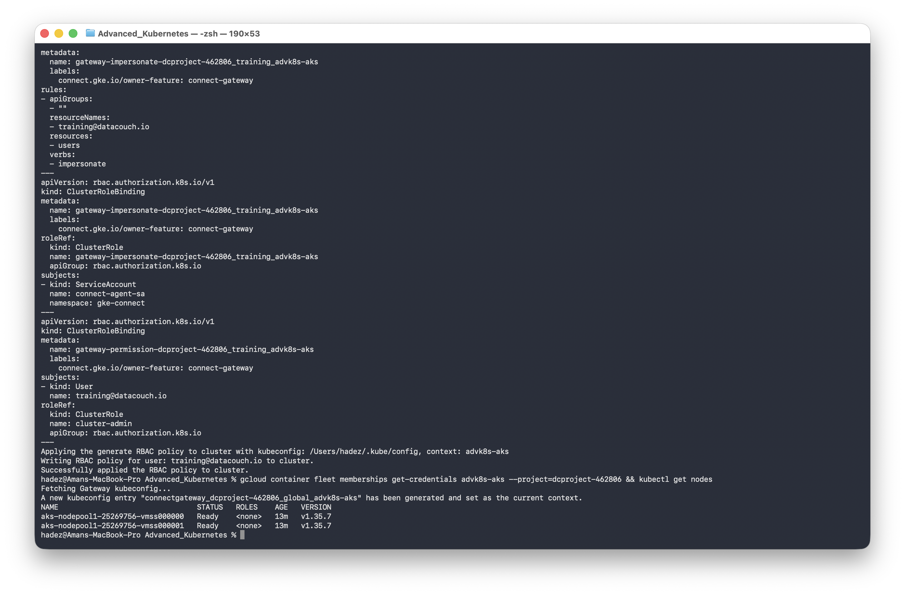
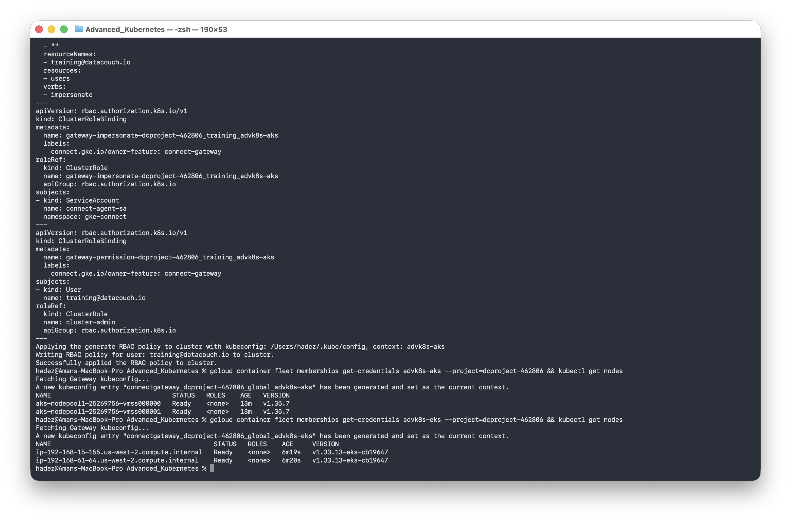
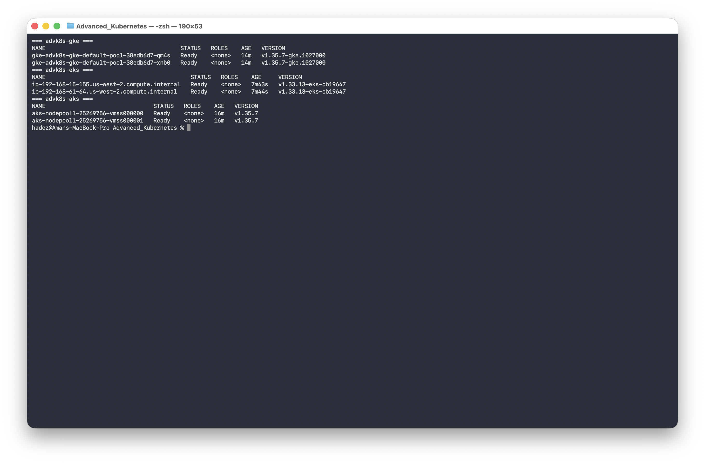
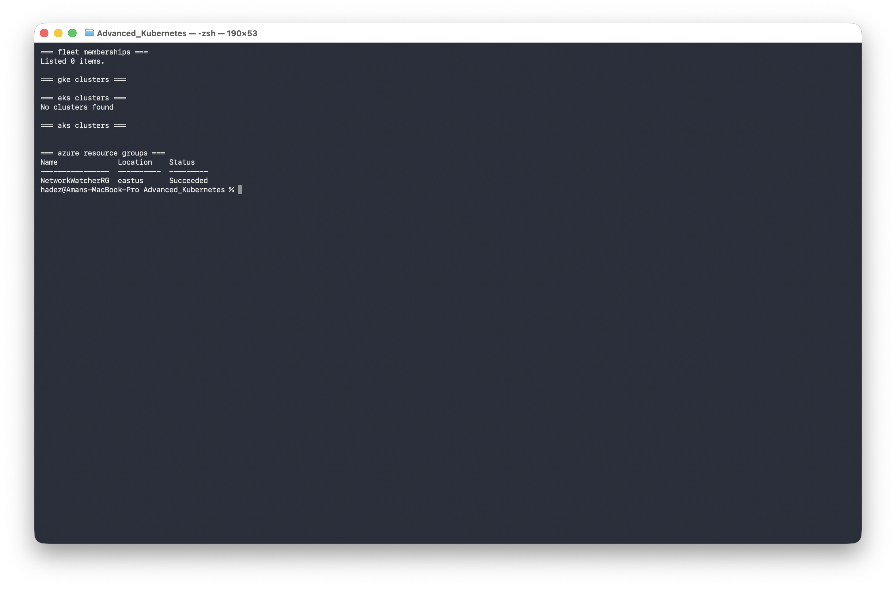
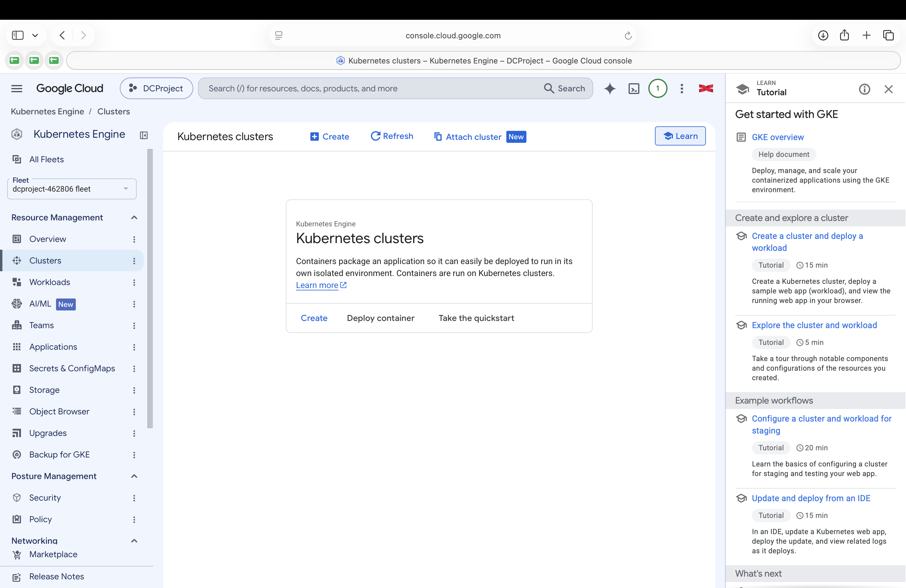

# Lab 3 — Connecting and Managing Multiple Clusters Across Cloud Providers

**Day 1 · Multi-Cluster & Service Mesh**

> Every command below was actually run end to end against the same real GKE, EKS, and AKS clusters from Lab 2, and every screenshot is a real `screencapture` of that run — including the full teardown at the end.

## What you'll learn

- Why "which cloud is this cluster in" shouldn't have to change how you authenticate to it.
- How to reach GKE, EKS, and AKS clusters through one unified path — **Connect Gateway** — using only your Google Cloud identity, with no AWS or Azure credentials on the client.
- Why fleet **attachment** (Lab 2) and Kubernetes **RBAC** are two separate layers, both of which you need.
- A practical pattern for running the same operation across every cluster in the fleet from one terminal.

## Time & cost

- **Time:** ~30-40 minutes.
- **Cost:** none beyond what Lab 2 is already spending — this lab reuses those three clusters. **This is where you tear everything down** (§3.5).

## Prerequisites

**[Lab 2](lab-02-gke-fleet-attached-clusters.md), completed, in the same sitting.** You need `advk8s-gke`, `advk8s-eks`, and `advk8s-aks` all provisioned and attached to your fleet, with `kubectl` contexts named accordingly.

---

## 3.1 The problem: three clouds, three ways to authenticate

Right now, reaching each cluster natively means three different tools and three different credential types:

```bash
kubectl --context advk8s-gke get nodes    # uses your gcloud identity
kubectl --context advk8s-eks get nodes    # uses your AWS IAM identity (via aws-iam-authenticator/aws eks get-token)
kubectl --context advk8s-aks get nodes    # uses your Azure AD identity (via kubelogin)
```

This works, but it means every person and every CI pipeline that needs multi-cluster access needs credentials provisioned in all three clouds. That's exactly what fleet attachment and **Connect Gateway** collapse into one path.

## 3.2 Connect Gateway: one identity, any fleet member

Fetch a gateway-specific kubeconfig entry for a fleet member — this works identically whether the member is native GKE or an attached EKS/AKS cluster:

```bash
gcloud container fleet memberships get-credentials advk8s-aks --project=$PROJECT_ID
kubectl get nodes
```

The first time you do this for a freshly-attached cluster, expect this:



```
Error from server (Forbidden): nodes is forbidden: User "training@datacouch.io" cannot list resource "nodes" in API group "" at the cluster scope
```

> **This is the layer distinction to internalize:** attaching a cluster to the fleet (Lab 2) makes it **visible and reachable** through Connect Gateway. It does **not** grant your identity any **Kubernetes RBAC** permission inside that cluster — those are separate authorization systems that happen to be chained together here. You still have to grant RBAC explicitly:

```bash
gcloud container fleet memberships generate-gateway-rbac \
  --membership=advk8s-aks \
  --users=you@example.com \
  --role=clusterrole/cluster-admin \
  --context=advk8s-aks \
  --kubeconfig=$HOME/.kube/config \
  --project=$PROJECT_ID \
  --apply
```



Read what this actually creates before you run it in a real environment — `--apply` writes RBAC objects straight to the target cluster:

- A `ClusterRole` + `ClusterRoleBinding` letting the **Connect agent's own service account** (`connect-agent-sa`, in-cluster) impersonate you, specifically — this is how a request that authenticated against Google's Connect Gateway ends up executing as your identity inside a cluster that has no idea what a Google identity is.
- A second `ClusterRoleBinding` granting **your** user the Kubernetes role you asked for (`cluster-admin` above — scope this down to something narrower than cluster-admin for anyone other than a lab environment).

Re-fetch credentials and retry:

```bash
gcloud container fleet memberships get-credentials advk8s-aks --project=$PROJECT_ID
kubectl get nodes
```

**Verified result:**

```
NAME                                STATUS   ROLES    AGE   VERSION
aks-nodepool1-25269756-vmss000000   Ready    <none>   13m   v1.35.7
aks-nodepool1-25269756-vmss000001   Ready    <none>   13m   v1.35.7
```

**That's an AKS cluster, reached with zero Azure credentials on this machine** — no `az login`, no `kubelogin`, nothing beyond the `gcloud` identity you already had. Repeat for EKS:

```bash
gcloud container fleet memberships generate-gateway-rbac \
  --membership=advk8s-eks \
  --users=you@example.com \
  --role=clusterrole/cluster-admin \
  --context=advk8s-eks \
  --kubeconfig=$HOME/.kube/config \
  --project=$PROJECT_ID \
  --apply

gcloud container fleet memberships get-credentials advk8s-eks --project=$PROJECT_ID
kubectl get nodes
```



**Verified result:**

```
NAME                                           STATUS   ROLES    AGE     VERSION
ip-192-168-15-155.us-west-2.compute.internal   Ready    <none>   6m6s    v1.33.13-eks-cb19647
ip-192-168-61-64.us-west-2.compute.internal    Ready    <none>   6m7s    v1.33.13-eks-cb19647
```

Zero AWS credentials involved — no `aws configure`, no IAM access keys on this path at all.

**One more contrast worth noting:** the *native* GKE member doesn't need an explicit `generate-gateway-rbac` grant the way the two attached clusters do —

```bash
gcloud container fleet memberships get-credentials advk8s-gke --project=$PROJECT_ID
kubectl get nodes
```

— works immediately, because Google already governs both the fleet membership *and* the cluster's IAM-based RBAC integration end to end. The extra RBAC step for EKS/AKS exists specifically because those clusters' own RBAC systems have never heard of a Google identity until you tell them to trust one.

Full evidence: [`evidence/lab03-connect-gateway-aks.txt`](evidence/lab03-connect-gateway-aks.txt) and [`evidence/lab03-full-fleet-connect-gateway.txt`](evidence/lab03-full-fleet-connect-gateway.txt).

> **Tested gotcha:** if `kubectl` fails with `exec: executable gke-gcloud-auth-plugin not found` even after `gcloud components install gke-gcloud-auth-plugin` reports success, it's a `PATH` problem, not an install problem — on a Homebrew-cask install of `gcloud` on macOS, the plugin lands in `google-cloud-sdk/bin/`, and only the `google-cloud-sdk` root (not its `bin/` subdirectory) is normally on `PATH`. Fix: `ln -sf "$(gcloud info --format='value(installation.sdk_root)')/bin/gke-gcloud-auth-plugin" /opt/homebrew/bin/`.

## 3.3 One control point, three clouds

With gateway kubeconfig entries for all three clusters, you can now script across the whole fleet without touching `aws` or `az` again:

```bash
for m in advk8s-gke advk8s-eks advk8s-aks; do
  echo "=== $m ==="
  gcloud container fleet memberships get-credentials "$m" --project=$PROJECT_ID >/dev/null 2>&1
  kubectl get nodes    # get-credentials sets current-context, so this always targets the right one
done
```

> Don't hardcode the generated context name — it's `connectgateway_<project>_<location>_<membership>`, and `<location>` is `global` for attached clusters (EKS, AKS) but the cluster's actual **region** for a native GKE member (`us-central1` here, not `global`). `get-credentials` always points `current-context` at whatever it just fetched, so relying on that instead of reconstructing the name avoids the mismatch entirely.



**Verified result, run for real against all three live clusters:**

```
=== advk8s-gke ===
NAME                                        STATUS   ROLES    AGE   VERSION
gke-advk8s-gke-default-pool-38edb6d7-qm4s   Ready    <none>   14m     v1.35.7-gke.1027000
gke-advk8s-gke-default-pool-38edb6d7-xnb0   Ready    <none>   14m     v1.35.7-gke.1027000
=== advk8s-eks ===
NAME                                           STATUS   ROLES    AGE     VERSION
ip-192-168-15-155.us-west-2.compute.internal   Ready    <none>   7m10s   v1.33.13-eks-cb19647
ip-192-168-61-64.us-west-2.compute.internal    Ready    <none>   7m11s   v1.33.13-eks-cb19647
=== advk8s-aks ===
NAME                                STATUS   ROLES    AGE   VERSION
aks-nodepool1-25269756-vmss000000   Ready    <none>   15m   v1.35.7
aks-nodepool1-25269756-vmss000001   Ready    <none>   15m   v1.35.7
```

One credential, three clouds, one loop. Full data: [`evidence/lab03-unified-multicloud-loop.txt`](evidence/lab03-unified-multicloud-loop.txt).

This is the pattern that scales: a GitOps controller, a CI pipeline, or an on-call engineer needs exactly one credential type (a Google identity with the right IAM + RBAC grants) to operate against every cluster in the fleet, regardless of which cloud actually runs it.

## 3.4 Where this leads on Day 2+

Connect Gateway solves *access*. It deliberately does not solve *deploying the same workload everywhere* or *keeping configuration in sync across clusters* — those are separate problems, typically solved with:

- **Multi-cluster GitOps** — Argo CD `ApplicationSet`s (cluster generator) or Flux, targeting every fleet member.
- **Anthos Config Management / Config Sync** — GKE Enterprise's native answer, fleet-aware out of the box.
- **A service mesh spanning the fleet** — the natural next step after Labs 4 and 5, extending mTLS and traffic policy across cluster boundaries, not just within one cluster.

If your organization's actual need is "run the same Deployment reliably in 5 clusters with per-cluster overrides," revisit [Lab 1 §B.2](lab-01-cluster-api-kubefed-federation.md) — that's precisely the KubeFed problem statement, and Karmada or OCM (linked there) are the maintained tools for it today.

---

## 3.5 Teardown — do this now

You've been running three live, billed clusters since Lab 2. Delete them in this order (attached-cluster unregistration first, so the fleet's records stay clean, then the underlying clusters):

```bash
# Unregister from the fleet
gcloud container attached clusters delete advk8s-eks --location=us-central1 --project=$PROJECT_ID --quiet
gcloud container attached clusters delete advk8s-aks --location=us-central1 --project=$PROJECT_ID --quiet

# Delete the actual clusters
eksctl delete cluster --name advk8s-eks --region us-west-2 --wait
az aks delete --resource-group advk8s-rg --name advk8s-aks --yes --no-wait
az group delete --name advk8s-rg --yes --no-wait
gcloud container clusters delete advk8s-gke --zone us-central1-a --project=$PROJECT_ID --quiet
```

Verify everything is actually gone — don't just trust that the commands above returned cleanly:

```bash
gcloud container fleet memberships list --project=$PROJECT_ID       # should be empty
gcloud container clusters list --project=$PROJECT_ID                # should be empty
eksctl get cluster --region us-west-2                                # should be empty
az aks list --output table                                          # should be empty
az group list --output table                                        # advk8s-rg should be gone (deletion is async — check again in a few minutes if it still shows)
```



The same result is visible in the Cloud Console (Kubernetes Engine → Clusters) — an empty clusters list for the project:



`az group delete` and `az aks delete` with `--no-wait` return immediately while deletion continues in the background — the resource group can take several minutes to actually disappear. Don't assume it's done just because the command returned.

**Verified:** this exact sequence was run against the real clusters used to test this lab. `gcloud container attached clusters delete` for both EKS and AKS completed cleanly, `eksctl delete cluster` fully removed the EKS VPC/CloudFormation stacks (`all cluster resources were deleted`), and `gcloud container clusters delete` removed the GKE cluster synchronously. Final state: `gcloud container fleet memberships list` → 0 items, `eksctl get cluster` → `No clusters found`, `az aks list` → empty, `az group list` → only the pre-existing `NetworkWatcherRG` remained (`advk8s-rg` gone).

---

## Lab summary

| | Verified |
|---|---|
| Connect Gateway access to native GKE member | ✅ |
| Connect Gateway access to attached AKS cluster (zero Azure credentials) | ✅ |
| Connect Gateway access to attached EKS cluster (zero AWS credentials) | ✅ |
| RBAC-vs-fleet-attachment distinction, demonstrated by the actual 403 → fix sequence | ✅ |
| Full teardown of all cross-cloud resources | ✅ |

## Evidence

- Screenshots: [`screenshots/lab02-03/`](screenshots/lab02-03/) (12 images, shared with Lab 2 — same three clusters, one continuous run)
- Logs: [`evidence/lab03-connect-gateway-aks.txt`](evidence/lab03-connect-gateway-aks.txt), [`evidence/lab03-full-fleet-connect-gateway.txt`](evidence/lab03-full-fleet-connect-gateway.txt), [`evidence/lab03-unified-multicloud-loop.txt`](evidence/lab03-unified-multicloud-loop.txt)

**Day 1 continues with:** [Lab 4 — Deploying Istio and configuring traffic shaping, retries, and circuit breaking](lab-04-istio-traffic-shaping.md).
