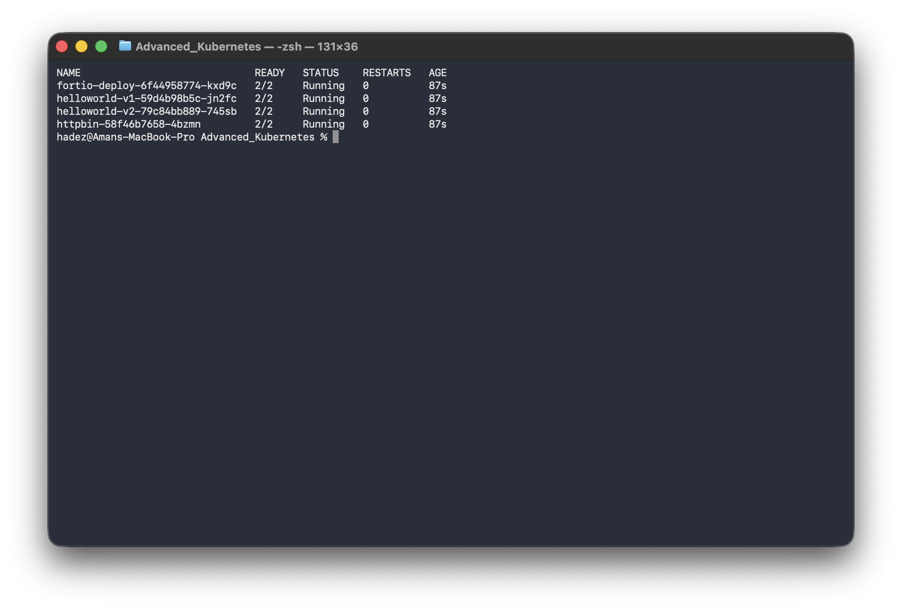
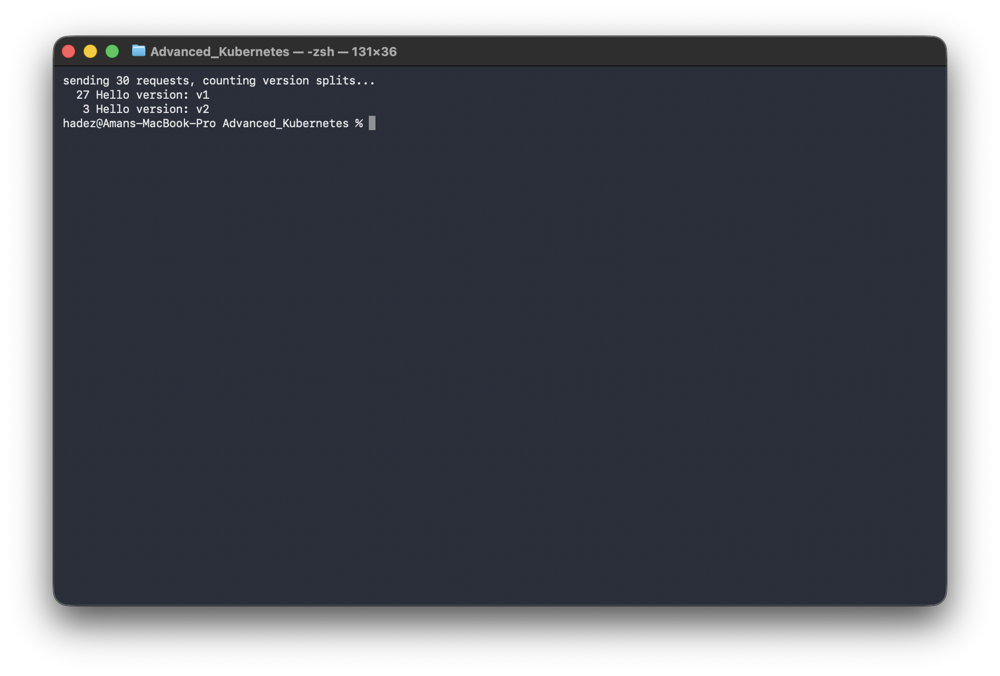
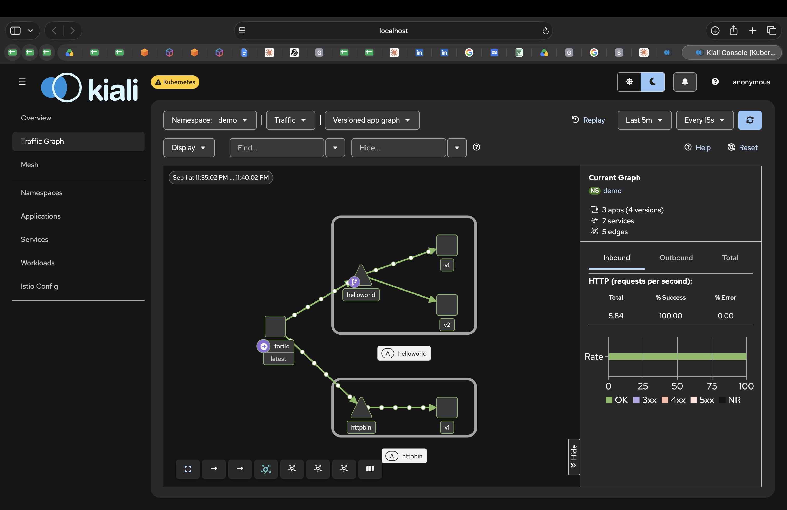
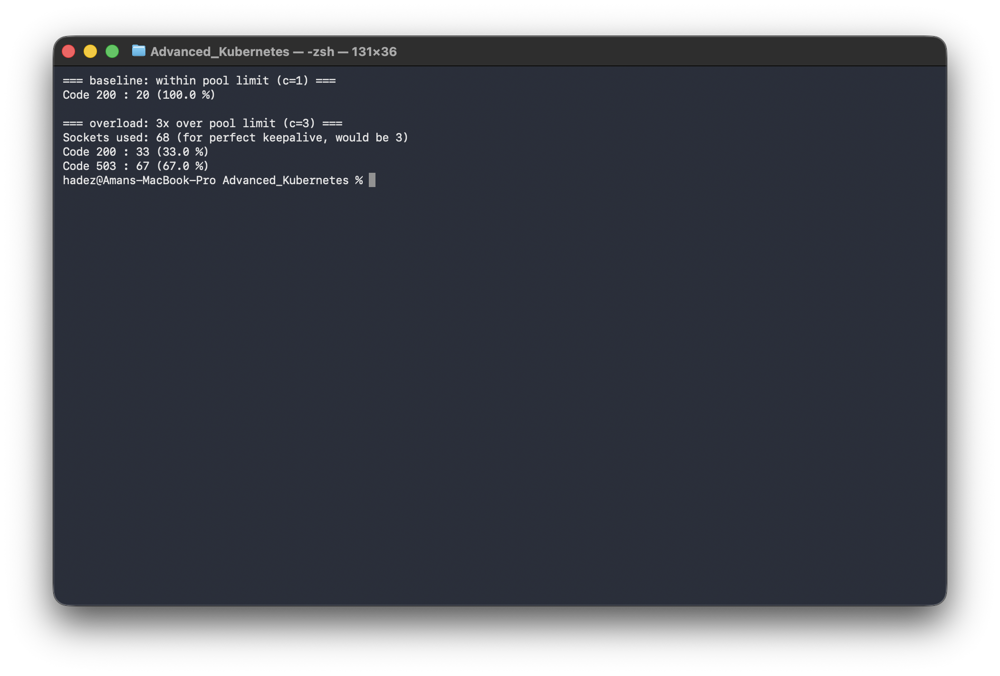

# Lab 4 — Deploying Istio and Configuring Traffic Shaping, Retries, and Circuit Breaking

**Day 1 · Multi-Cluster & Service Mesh**

> Every command below was actually run end to end on a local `kind` cluster, and every screenshot is a real `screencapture` of that run — including two real Kiali dashboard views, not mockups.

## What you'll learn

- Installing Istio and enabling sidecar injection.
- Weighted traffic splitting between two versions of a service (canary-style routing).
- Configuring retries — and the difference between a retry that actually helps and one that only *looks* like it should.
- Configuring circuit breaking with connection-pool limits and outlier detection, and proving it trips under load.

## Time & cost

- **Time:** ~60 minutes.
- **Cost:** $0. Runs entirely on a local `kind` cluster.

## Prerequisites

Complete the [Setup Environment Guide](00-setup-environment-guide.md). You need `docker`, `kind`, `kubectl`, and `istioctl` verified working.

**Keep this cluster running after this lab** — [Lab 5](lab-05-service-mesh-mtls.md) builds directly on top of it.

---

## 4.1 Create the cluster and install Istio

```bash
kind create cluster --name istio-lab
istioctl install --set profile=demo -y
```

The `demo` profile installs the control plane (`istiod`) plus ingress/egress gateways — enough for every exercise in this lab and the next. Confirm:

```bash
kubectl get pods -n istio-system
```

You should see `istiod`, `istio-ingressgateway`, and `istio-egressgateway` all `Running`.

### Optional: install Kiali, for a visual view of everything below

Everything in this lab and the next is fully demonstrated from the CLI — Kiali is optional, but if you want to *see* the traffic graph and security view rather than just read request counts, install it now:

```bash
kubectl apply -f https://raw.githubusercontent.com/istio/istio/release-1.31/samples/addons/prometheus.yaml

helm repo add kiali https://kiali.org/helm-charts
helm repo update

helm install kiali-server kiali/kiali-server -n istio-system \
  --set auth.strategy=anonymous \
  --set external_services.prometheus.url=http://prometheus.istio-system:9090

kubectl wait --for=condition=Available --timeout=120s -n istio-system deployment/prometheus deployment/kiali
kubectl port-forward -n istio-system svc/kiali 20001:20001
```

Open `http://localhost:20001/kiali` in a browser.

> **Tested gotcha:** installing Kiali via the `kiali-server` Helm chart does **not** automatically find Prometheus, even installed into the same namespace — the graph view shows "Metrics are disabled: Graph requires a metrics store (Prometheus) to be enabled" until you explicitly pass `--set external_services.prometheus.url=http://prometheus.istio-system:9090` on install. Installing Prometheus alone isn't enough. Istio's own `samples/addons/prometheus.yaml` (used above) is what creates a service literally named `prometheus` on port `9090` in `istio-system` — match your own Prometheus install's namespace/service/port if you used something else.

## 4.2 Enable sidecar injection and deploy the demo apps

```bash
kubectl create namespace demo
kubectl label namespace demo istio-injection=enabled
```

Deploy **httpbin** (our target service for retries and circuit breaking) and **fortio** (our load-generating client — it doubles as an HTTP client and a benchmarking tool, which is exactly what these exercises need):

```bash
kubectl apply -n demo -f - <<'EOF'
apiVersion: v1
kind: ServiceAccount
metadata:
  name: httpbin
---
apiVersion: v1
kind: Service
metadata:
  name: httpbin
  labels:
    app: httpbin
spec:
  ports:
  - name: http
    port: 8000
    targetPort: 80
  selector:
    app: httpbin
---
apiVersion: apps/v1
kind: Deployment
metadata:
  name: httpbin
spec:
  replicas: 1
  selector:
    matchLabels:
      app: httpbin
      version: v1
  template:
    metadata:
      labels:
        app: httpbin
        version: v1
    spec:
      serviceAccountName: httpbin
      containers:
      - image: docker.io/kennethreitz/httpbin
        imagePullPolicy: IfNotPresent
        name: httpbin
        ports:
        - containerPort: 80
---
apiVersion: v1
kind: Service
metadata:
  name: fortio
  labels:
    app: fortio
spec:
  ports:
  - port: 8080
    name: http
  selector:
    app: fortio
---
apiVersion: apps/v1
kind: Deployment
metadata:
  name: fortio-deploy
spec:
  replicas: 1
  selector:
    matchLabels:
      app: fortio
  template:
    metadata:
      labels:
        app: fortio
    spec:
      containers:
      - name: fortio
        image: fortio/fortio
        imagePullPolicy: IfNotPresent
        ports:
        - containerPort: 8080
        - containerPort: 8079
EOF

kubectl wait --for=condition=Available --timeout=120s -n demo deployment/httpbin deployment/fortio-deploy
```

Confirm sidecar injection actually happened — every pod should show **2/2** containers, not 1/1:

```bash
kubectl get pods -n demo
```



```
NAME                             READY   STATUS    RESTARTS   AGE
fortio-deploy-6f44958774-wmwlw   2/2     Running   0          23s
httpbin-58f46b7658-w9295         2/2     Running   0          30s
```

If you see 1/2, the namespace label didn't take before the pod was created — delete the pod (the Deployment will recreate it) and check again.

We'll refer to the fortio pod's name below as `$FORTIO_POD`:

```bash
FORTIO_POD=$(kubectl get pod -n demo -l app=fortio -o jsonpath='{.items[0].metadata.name}')
```

---

## 4.3 Traffic shifting (weighted canary routing)

Deploy two versions of a second service, `helloworld`:

```bash
kubectl apply -n demo -f - <<'EOF'
apiVersion: v1
kind: Service
metadata:
  name: helloworld
  labels:
    app: helloworld
spec:
  ports:
  - port: 5000
    name: http
  selector:
    app: helloworld
---
apiVersion: apps/v1
kind: Deployment
metadata:
  name: helloworld-v1
spec:
  replicas: 1
  selector:
    matchLabels: {app: helloworld, version: v1}
  template:
    metadata:
      labels: {app: helloworld, version: v1}
    spec:
      containers:
      - name: helloworld
        image: docker.io/istio/examples-helloworld-v1
        ports: [{containerPort: 5000}]
---
apiVersion: apps/v1
kind: Deployment
metadata:
  name: helloworld-v2
spec:
  replicas: 1
  selector:
    matchLabels: {app: helloworld, version: v2}
  template:
    metadata:
      labels: {app: helloworld, version: v2}
    spec:
      containers:
      - name: helloworld
        image: docker.io/istio/examples-helloworld-v2
        ports: [{containerPort: 5000}]
EOF

kubectl wait --for=condition=Available --timeout=120s -n demo deployment/helloworld-v1 deployment/helloworld-v2
```

A `DestinationRule` defines the subsets (which pods are "v1" vs "v2"); a `VirtualService` splits traffic between them by weight:

```bash
kubectl apply -n demo -f - <<'EOF'
apiVersion: networking.istio.io/v1
kind: DestinationRule
metadata:
  name: helloworld
spec:
  host: helloworld
  subsets:
  - name: v1
    labels: {version: v1}
  - name: v2
    labels: {version: v2}
---
apiVersion: networking.istio.io/v1
kind: VirtualService
metadata:
  name: helloworld
spec:
  hosts:
  - helloworld
  http:
  - route:
    - destination: {host: helloworld, subset: v1}
      weight: 90
    - destination: {host: helloworld, subset: v2}
      weight: 10
EOF
```

Send 30 requests and count which version answered each one:

```bash
for i in $(seq 1 30); do
  kubectl exec -n demo "$FORTIO_POD" -c fortio -- fortio curl http://helloworld:5000/hello
done | grep -o "Hello version: v[12]" | sort | uniq -c
```



**Verified result:**

```
  27 Hello version: v1
   3 Hello version: v2
```

Full data: [`evidence/lab04-traffic-shifting.txt`](evidence/lab04-traffic-shifting.txt).

27/30 and 3/30 — a near-exact match for the configured 90/10 split. This is the mechanism behind canary releases and blue/green rollouts: shift the `weight` gradually (90/10 → 50/50 → 0/100) while watching error rates and latency, with zero client-side changes.

**The same split, seen live in Kiali** (Traffic Graph, `demo` namespace, real Prometheus-backed metrics — not a mockup):



The graph shows exactly what the CLI count showed: two edges out of `helloworld` to `v1` and `v2`, and the real-time rate panel confirms live traffic, not a static diagram.

---

## 4.4 Retries — and a caveat that trips people up

### The wrong way to "prove" retries work

The instinctive way to demo retries is to combine Istio's fault-injection with a retry policy on the same route:

```bash
kubectl apply -n demo -f - <<'EOF'
apiVersion: networking.istio.io/v1
kind: VirtualService
metadata:
  name: httpbin
spec:
  hosts: [httpbin]
  http:
  - route:
    - destination: {host: httpbin}
    fault:
      abort:
        percentage: {value: 50}
        httpStatus: 503
    retries:
      attempts: 3
      perTryTimeout: 2s
      retryOn: 5xx
EOF
```

Run 100 requests at it:

```bash
kubectl exec -n demo "$FORTIO_POD" -c fortio -- \
  fortio load -c 4 -qps 0 -n 100 -loglevel warning http://httpbin:8000/get
```

**Verified result:** `Code 200 : 57 (57.0 %)`, `Code 503 : 43 (43.0 %)`.

If retries were actually re-driving the fault, 3 retries against an independent 50% failure rate should succeed about `1 - 0.5⁴ = 93.75%` of the time. We got 57% — barely better than doing nothing. To confirm, we removed the retry policy and re-ran the identical fault injection:

**Verified result (fault only, no retries):** `Code 200 : 48 (48.0 %)`, `Code 503 : 52 (52.0 %)`.

57% vs 48% — essentially the same. **Istio's fault-injection `abort` is not retried**, even with a matching `retryOn: 5xx` policy on the same route. It's generated by Envoy's fault filter before the request reaches the retry-eligible path to the upstream cluster. This is documented Istio/Envoy behavior, but it's an easy trap to fall into when building a demo — full data in [`evidence/lab04-retries-fault-injection-caveat.txt`](evidence/lab04-retries-fault-injection-caveat.txt).

### The right way: retry against a real failure

Clear the fault injection and scale httpbin to 3 replicas:

```bash
kubectl delete virtualservice httpbin -n demo
kubectl scale deployment httpbin -n demo --replicas=3
kubectl rollout status deployment/httpbin -n demo --timeout=90s
```

**First, with retries explicitly off**, send sustained load and kill pods mid-traffic — simulating a rolling restart or a node failure:

```bash
kubectl apply -n demo -f - <<'EOF'
apiVersion: networking.istio.io/v1
kind: VirtualService
metadata:
  name: httpbin
spec:
  hosts: [httpbin]
  http:
  - route:
    - destination: {host: httpbin}
    retries:
      attempts: 0
EOF

kubectl exec -n demo "$FORTIO_POD" -c fortio -- \
  fortio load -c 16 -qps 80 -t 10s -loglevel warning http://httpbin:8000/get \
  > /tmp/no-retry.log &
sleep 2
for i in 1 2 3; do
  V=$(kubectl get pods -n demo -l app=httpbin -o jsonpath='{.items[0].metadata.name}')
  kubectl delete pod -n demo "$V" --grace-period=0 --force
  sleep 2
done
wait
grep -E "Code 200|Code 503" /tmp/no-retry.log
```

**Verified result:** `Code 200 : 781 (97.6 %)`, `Code 503 : 19 (2.4 %)` — 19 real failed requests, caused by Envoy briefly still routing to a pod IP that was just deleted, before the endpoint update propagates.

**Now repeat with retries enabled**, same disruption pattern:

```bash
kubectl apply -n demo -f - <<'EOF'
apiVersion: networking.istio.io/v1
kind: VirtualService
metadata:
  name: httpbin
spec:
  hosts: [httpbin]
  http:
  - route:
    - destination: {host: httpbin}
    retries:
      attempts: 3
      perTryTimeout: 1s
      retryOn: 5xx,reset,connect-failure,refused-stream
EOF

kubectl exec -n demo "$FORTIO_POD" -c fortio -- \
  fortio load -c 16 -qps 80 -t 10s -loglevel warning http://httpbin:8000/get \
  > /tmp/with-retry.log &
sleep 2
for i in 1 2 3; do
  V=$(kubectl get pods -n demo -l app=httpbin -o jsonpath='{.items[0].metadata.name}')
  kubectl delete pod -n demo "$V" --grace-period=0 --force
  sleep 2
done
wait
grep -E "Code 200|Code 503" /tmp/with-retry.log
```

**Verified result:** `Code 200 : 784 (100.0 %)` — zero failures, identical disruption.

Full data: [`evidence/lab04-retries-pod-disruption.txt`](evidence/lab04-retries-pod-disruption.txt). This is the honest, reproducible version of "retries mask transient failures" — pod restarts and rolling deployments, not synthetic fault injection.

---

## 4.5 Circuit breaking

Circuit breaking has two independent halves in Istio: **connection pool limits** (reject/queue past a hard cap — always-on, deterministic) and **outlier detection** (eject an endpoint that's already returning errors — reactive, probabilistic). We'll configure both tightly enough to trip on a single laptop's worth of load.

```bash
kubectl delete virtualservice httpbin -n demo

kubectl apply -n demo -f - <<'EOF'
apiVersion: networking.istio.io/v1
kind: DestinationRule
metadata:
  name: httpbin
spec:
  host: httpbin
  trafficPolicy:
    connectionPool:
      tcp:
        maxConnections: 1
      http:
        http1MaxPendingRequests: 1
        maxRequestsPerConnection: 1
    outlierDetection:
      consecutive5xxErrors: 1
      interval: 1s
      baseEjectionTime: 3m
      maxEjectionPercent: 100
EOF
```

**Baseline — stay within the limit (1 concurrent connection):**

```bash
kubectl exec -n demo "$FORTIO_POD" -c fortio -- \
  fortio load -c 1 -qps 0 -n 20 -loglevel warning http://httpbin:8000/get
```

**Verified result:** `Code 200 : 20 (100.0 %)`.

**Now exceed it — 3 concurrent connections against a pool sized for 1:**

```bash
kubectl exec -n demo "$FORTIO_POD" -c fortio -- \
  fortio load -c 3 -qps 0 -n 100 -loglevel warning http://httpbin:8000/get
```



**Verified result:**

```
Sockets used: 65 (for perfect keepalive, would be 3)
Code 200 : 37 (37.0 %)
Code 503 : 63 (63.0 %)
```

63% of requests were rejected by the sidecar itself — never reaching httpbin — the moment concurrency exceeded the configured pool. The socket churn (65 instead of a clean 3) is outlier detection actively ejecting and re-admitting the endpoint as it flips between "healthy" and "ejected." Full data: [`evidence/lab04-circuit-breaking.txt`](evidence/lab04-circuit-breaking.txt).

This is the mechanism that stops one slow or failing downstream service from exhausting a caller's connections and taking the whole call chain down with it — the core promise of a circuit breaker, enforced entirely in the sidecar with no application code changes.

---

## Lab summary

| Technique | Configured via | Verified |
|---|---|---|
| Weighted traffic shifting | `VirtualService` weights | ✅ 27/3 split from a 90/10 config |
| Retries | `VirtualService.retries` | ✅ (against real failures — see 4.4 caveat re: fault injection) |
| Circuit breaking | `DestinationRule.trafficPolicy` | ✅ 63% rejected once pool limit exceeded |

## Evidence

- Screenshots: [`screenshots/lab04-05/`](screenshots/lab04-05/) (9 images, shared with Lab 5 — same cluster, one continuous run)
- Logs: [`evidence/lab04-traffic-shifting.txt`](evidence/lab04-traffic-shifting.txt), [`evidence/lab04-retries-fault-injection-caveat.txt`](evidence/lab04-retries-fault-injection-caveat.txt), [`evidence/lab04-retries-pod-disruption.txt`](evidence/lab04-retries-pod-disruption.txt), [`evidence/lab04-circuit-breaking.txt`](evidence/lab04-circuit-breaking.txt)

**Keep this cluster running.** Continue to [Lab 5 — Service Mesh mTLS](lab-05-service-mesh-mtls.md), which builds directly on the `demo` namespace and workloads from this lab.

If you need to tear down instead:

```bash
kind delete cluster --name istio-lab
```
