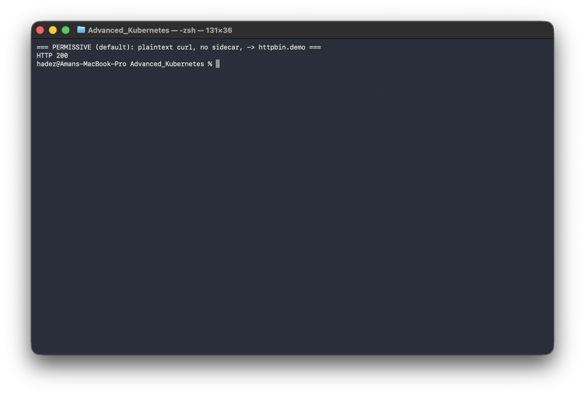
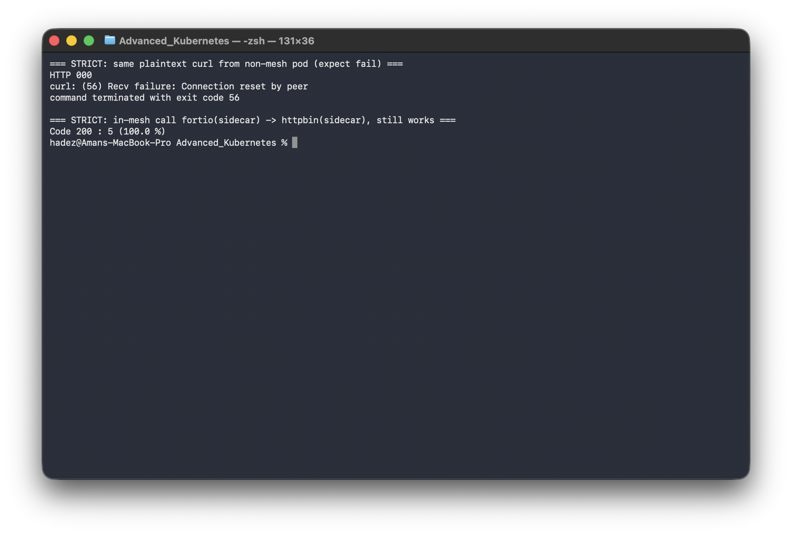
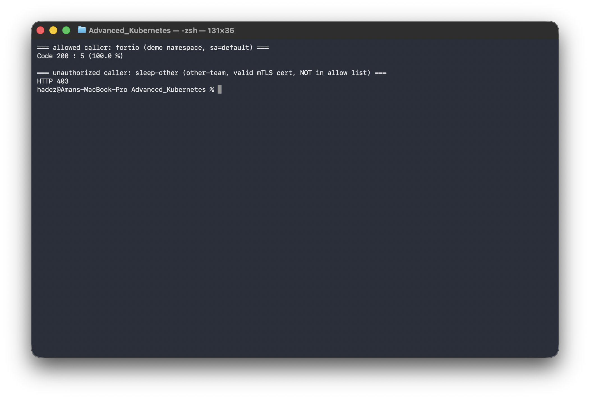
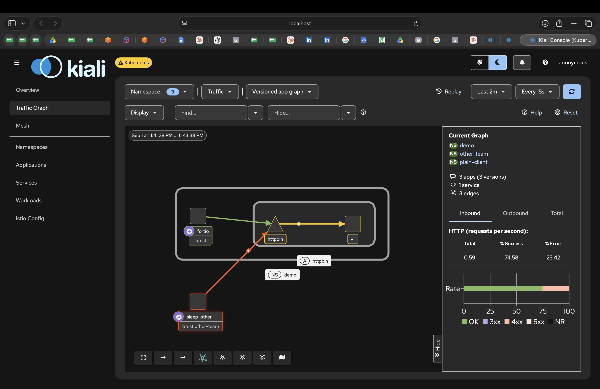
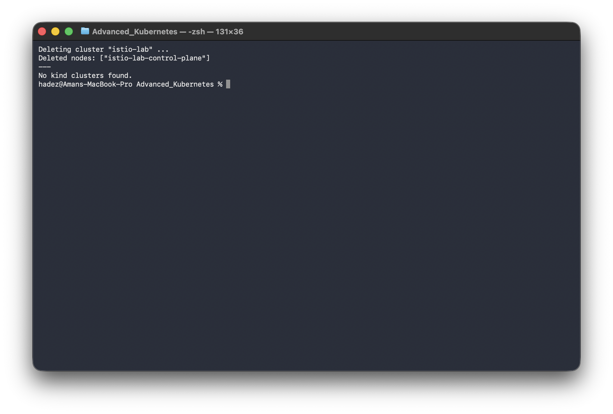

# Lab 5 — Deploying a Service Mesh and Configuring Traffic Policies, Including mTLS

**Day 1 · Multi-Cluster & Service Mesh**

> Every command below was actually run end to end on the same cluster as Lab 4, and every screenshot is a real `screencapture` of that run — including a real Kiali security view, not a mockup.

## What you'll learn

- The difference between Istio's two mTLS modes, PERMISSIVE and STRICT, and what each actually allows on the wire.
- How to enforce STRICT mTLS for a namespace and verify — behaviorally, not just by reading YAML — that plaintext traffic is actually rejected.
- How `AuthorizationPolicy` layers identity-based access control on top of mTLS: a valid mesh certificate proves *who* a caller is, not *what* they're allowed to do.

## Time & cost

- **Time:** ~40 minutes.
- **Cost:** $0. Runs entirely on a local `kind` cluster.

## Prerequisites

**This lab builds directly on [Lab 4](lab-04-istio-traffic-shaping.md).** You need the `istio-lab` kind cluster, Istio installed, and the `demo` namespace with `httpbin` and `fortio` running.

If you're jumping straight to this lab without having done Lab 4, the minimum setup is:

```bash
kind create cluster --name istio-lab
istioctl install --set profile=demo -y
kubectl create namespace demo
kubectl label namespace demo istio-injection=enabled
# then deploy httpbin + fortio — see Lab 4 §4.2 for the full manifest
```

We strongly recommend actually doing Lab 4 first — this lab reuses its services and its findings build on each other.

---

## 5.1 Baseline: PERMISSIVE mode accepts plaintext

Istio's default `PeerAuthentication` mode is **PERMISSIVE** — sidecars accept both mTLS and plaintext traffic on the same port, which is what makes it safe to enable Istio incrementally on a live cluster without an outage. Let's prove that concretely by talking to a mesh service **from outside the mesh**.

Deploy a plain client with no sidecar, in a namespace that isn't labeled for injection:

```bash
kubectl create namespace plain-client

kubectl apply -n plain-client -f - <<'EOF'
apiVersion: apps/v1
kind: Deployment
metadata:
  name: sleep-plain
spec:
  replicas: 1
  selector:
    matchLabels: {app: sleep-plain}
  template:
    metadata:
      labels: {app: sleep-plain}
    spec:
      containers:
      - name: sleep
        image: curlimages/curl
        command: ["sleep", "infinity"]
EOF

kubectl wait --for=condition=Available --timeout=60s -n plain-client deployment/sleep-plain
```

Confirm it has **no** sidecar (1/1, not 2/2):

```bash
kubectl get pods -n plain-client
```

Call `httpbin` in the `demo` namespace over plain HTTP:

```bash
SLEEP_POD=$(kubectl get pod -n plain-client -l app=sleep-plain -o jsonpath='{.items[0].metadata.name}')
kubectl exec -n plain-client "$SLEEP_POD" -- \
  curl -sS -o /dev/null -w "HTTP %{http_code}\n" http://httpbin.demo:8000/get --max-time 5
```



**Verified result:** `HTTP 200`. A completely unauthenticated, plaintext client outside the mesh reaches a meshed service without friction. This is expected under PERMISSIVE — and it's exactly why you shouldn't assume "we installed Istio" means "our traffic is encrypted and authenticated." It means it *can* be, once you turn on enforcement.

## 5.2 Enforce STRICT mTLS

`PeerAuthentication` is namespace- (or mesh-) scoped. Enforce it for `demo`:

```bash
kubectl apply -n demo -f - <<'EOF'
apiVersion: security.istio.io/v1
kind: PeerAuthentication
metadata:
  name: default
spec:
  mtls:
    mode: STRICT
EOF
```

Re-run the **exact same plaintext call** from the un-meshed pod:

```bash
kubectl exec -n plain-client "$SLEEP_POD" -- \
  curl -sS -o /dev/null -w "HTTP %{http_code}\n" http://httpbin.demo:8000/get --max-time 5
```

**Verified result:**

```
curl: (56) Recv failure: Connection reset by peer
```

No HTTP response at all — the TLS handshake itself fails, because the plain client has no mesh certificate to present. This is the behavioral proof that matters: not "the YAML says STRICT," but "an actual unauthenticated caller is actually rejected at the transport layer."

Now confirm **in-mesh** traffic is unaffected — call the same service from `fortio`, which does have a sidecar:

```bash
FORTIO_POD=$(kubectl get pod -n demo -l app=fortio -o jsonpath='{.items[0].metadata.name}')
kubectl exec -n demo "$FORTIO_POD" -c fortio -- \
  fortio load -c 1 -qps 0 -n 5 -loglevel warning http://httpbin:8000/get
```



**Verified result:** `Code 200 : 5 (100.0 %)` — unaffected. Every hop between sidecars was already being upgraded to mTLS automatically; STRICT mode just closes off the plaintext fallback that PERMISSIVE left open.

Confirm the mode Istio itself reports for the workload:

```bash
istioctl x describe pod "$FORTIO_POD" -n demo
```

**Verified output (relevant lines):**

```
   Workload mTLS mode: STRICT
Applied PeerAuthentication:
   default.demo
```

Full data: [`evidence/lab05-mtls-strict.txt`](evidence/lab05-mtls-strict.txt).

---

## 5.3 mTLS proves identity; `AuthorizationPolicy` decides access

A common misunderstanding: "we turned on mTLS, so our services are locked down." mTLS proves **who is calling** (a cryptographic identity, derived from the caller's service account: `cluster.local/ns/<namespace>/sa/<service-account>`). It does **not**, by itself, decide **who's allowed to call what** — that's `AuthorizationPolicy`. Let's show both halves.

Restrict `httpbin` to accept traffic only from workloads using the `default` service account in the `demo` namespace:

```bash
kubectl apply -n demo -f - <<'EOF'
apiVersion: security.istio.io/v1
kind: AuthorizationPolicy
metadata:
  name: httpbin-allow-fortio-only
spec:
  selector:
    matchLabels: {app: httpbin}
  action: ALLOW
  rules:
  - from:
    - source:
        principals: ["cluster.local/ns/demo/sa/default"]
EOF
```

Traffic from `fortio` (which runs as `demo/sa/default`) should still work:

```bash
kubectl exec -n demo "$FORTIO_POD" -c fortio -- \
  fortio load -c 1 -qps 0 -n 5 -loglevel warning http://httpbin:8000/get
```

**Verified result:** `Code 200 : 5 (100.0 %)`.

Now deploy a second client, **fully in the mesh** (sidecar and all), but in a different namespace with a different identity:

```bash
kubectl create namespace other-team
kubectl label namespace other-team istio-injection=enabled

kubectl apply -n other-team -f - <<'EOF'
apiVersion: apps/v1
kind: Deployment
metadata:
  name: sleep-other
spec:
  replicas: 1
  selector:
    matchLabels: {app: sleep-other}
  template:
    metadata:
      labels: {app: sleep-other}
    spec:
      containers:
      - name: sleep
        image: curlimages/curl
        command: ["sleep", "infinity"]
EOF

kubectl wait --for=condition=Available --timeout=90s -n other-team deployment/sleep-other
```

Call `httpbin` from this pod — it has a perfectly valid mTLS certificate (it's in the mesh), but the wrong identity:

```bash
SLEEP_OTHER=$(kubectl get pod -n other-team -l app=sleep-other -o jsonpath='{.items[0].metadata.name}')
kubectl exec -n other-team "$SLEEP_OTHER" -- \
  curl -sS -o /dev/null -w "HTTP %{http_code}\n" http://httpbin.demo:8000/get --max-time 5
```



**Verified result:** `HTTP 403`.

**The same distinction, seen live in Kiali's security view**, with both `plain-client` and `other-team` generating traffic toward `httpbin` at once:



The green edge (`fortio` → `httpbin`) and the red edge (`sleep-other` → `httpbin`, driven by the repeated 403s) sit side by side on the same graph — a valid mTLS identity got the connection established, and `AuthorizationPolicy` still said no.

Side by side:

| Caller | In mesh? | Valid mTLS cert? | Allowed by `AuthorizationPolicy`? | Result |
|---|---|---|---|---|
| `plain-client/sleep-plain` | No | No | — | Connection reset (5.2) |
| `other-team/sleep-other` | Yes | Yes | No — wrong principal | `403` |
| `demo/fortio` | Yes | Yes | Yes | `200` |

Full data: [`evidence/lab05-authorization-policy.txt`](evidence/lab05-authorization-policy.txt). This is the layering to internalize: **mTLS is necessary but not sufficient.** A valid mesh identity gets you authenticated, not authorized.

---

## Lab summary

| Policy | Enforced via | Verified |
|---|---|---|
| Reject plaintext (mTLS) | `PeerAuthentication` STRICT | ✅ `200` → connection reset |
| Allow legitimate mesh traffic | (unaffected by the above) | ✅ still `200` |
| Identity-based access control | `AuthorizationPolicy` | ✅ authenticated-but-unauthorized caller → `403` |

## Clean up

```bash
kind delete cluster --name istio-lab
```



## Evidence

- Screenshots: [`screenshots/lab04-05/`](screenshots/lab04-05/) (9 images, shared with Lab 4 — same cluster, one continuous run)
- Logs: [`evidence/lab05-mtls-strict.txt`](evidence/lab05-mtls-strict.txt), [`evidence/lab05-authorization-policy.txt`](evidence/lab05-authorization-policy.txt)

**Next:** Day 1 continues with [Lab 2 — GKE fleet management with attached AWS and Azure clusters](lab-02-gke-fleet-attached-clusters.md), if you haven't done it yet.
